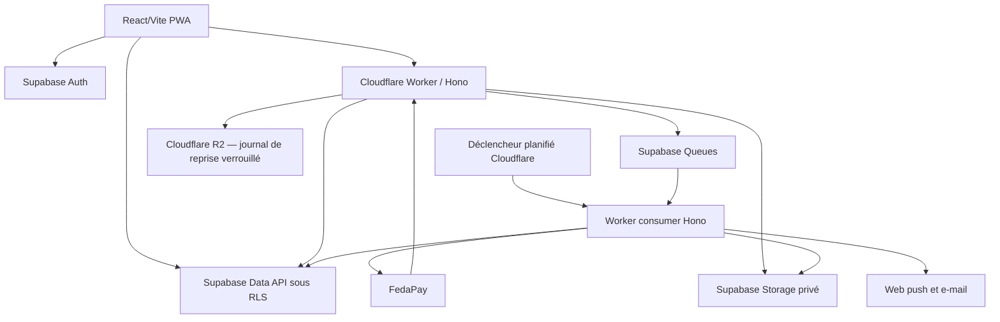
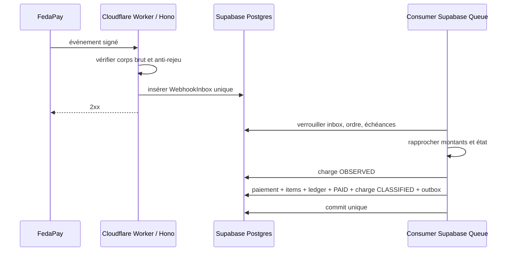

# STI — Spécifications techniques d’implémentation — Gestion Locative IA V1

> Spécification technique autonome destinée à Codex
>
> - Produit ciblé : **Loya V1**
> - Portée : architecture, données, sécurité, API, traitements, tests et exploitation complets
> - Ensemble d’implémentation courant : [PRD](./PRD_Gestion_Locative_IA_V1.md), [DESIGN](./DESIGN_Gestion_Locative_IA_V1.md) et [ROADMAP](./ROADMAP_Gestion_Locative_IA_V1.md)
> - Statut : **normatif et prêt pour implémentation**

## 0. Contrat d’exécution pour Codex

1. Lire ce STI et le PRD en entier avant toute migration ou logique financière.
2. Implémenter d’abord les invariants, contraintes et tests de domaine, puis les interfaces.
3. Ne jamais faire autorité depuis le client pour un montant, un taux, un rôle ou un statut.
4. Toute mutation financière est **atomique, idempotente, autorisée, journalisée et auditée**.
5. Toute donnée appartenant à une agence, un Locataire ou un Propriétaire est isolée à la fois par le Worker, les grants PostgreSQL et la RLS Supabase.
6. Toute valeur de configuration dépendante d’un environnement ou d’un contrat fournisseur est fixée explicitement dans le dépôt, testée et reliée à sa porte d’activation. Aucune configuration ne peut annuler une règle `BR-*` du PRD.
7. Les versions de runtime et de dépendances sont des versions stables maintenues, épinglées dans le dépôt et validées par CI ; ne pas coder contre une version flottante.

## 1. Architecture cible

### 1.1 Vue d’ensemble



Règles de frontière :

- `apps/web` est une PWA React/Vite servie par Cloudflare Workers Static Assets. Elle affiche et collecte l’intention ; elle ne confirme ni ne calcule de valeur financière autoritative.
- `apps/worker` expose l’API Hono `/v1`, reçoit le webhook FedaPay avec son corps brut, vérifie les JWT Supabase et exécute les commandes sensibles.
- Supabase Auth gère OTP e-mail, Google OAuth, sessions, refresh tokens et liaison automatique standard des identités ; Loya ne réimplémente aucun fournisseur d’identité.
- Supabase Postgres est la source de vérité financière. Les lectures autorisées peuvent utiliser la Data API avec le jeton utilisateur ; les mutations métier passent par le Worker et des fonctions SQL transactionnelles contrôlées.
- Supabase Queues transporte inbox/outbox, reçus, notifications, relances et rapprochement. `ctx.waitUntil` peut réduire la latence, mais seul le message durable et le Worker planifié garantissent la reprise.
- Avant tout appel créant une charge, une enveloppe canonique durable et chiffrée est créée dans un bucket Cloudflare R2 dédié avec verrou de rétention et création conditionnelle ; elle conserve les éléments nécessaires à la reconstruction, mais n’autorise jamais seule un état `PAID`.
- Supabase Storage utilise uniquement des buckets privés ; les reçus et justificatifs sont servis après autorisation par URL signée courte ou réponse proxy contrôlée.
- Aucune dépendance Redis/BullMQ ni session applicative parallèle n’existe en V1.

### 1.2 Monorepo

```text
apps/
  web/                 React, Vite, PWA, quatre contextes
  worker/              Hono, REST /v1, webhook, queue et tâches planifiées
packages/
  core/                règles pures, montants, états, écritures
  schemas/             Zod, DTO, codes d’erreur, types partagés
  auth/                client Supabase Auth, gardes et intentions d’accès
  db/                  migrations Supabase, RLS, pgTAP, RPC et repositories
  ui/                  tokens et composants accessibles
  payments/            port PaymentProvider + adaptateur FedaPay
  recovery/            journal Cloudflare R2 verrouillé et reconstruction contrôlée
  storage/             Supabase Storage privé et URLs signées
  notifications/       ports in-app, push, e-mail
  config/              configuration typée par environnement
  observability/       logs, traces, métriques, corrélation
```

Contraintes de dépôt : TypeScript strict, workspace `pnpm` et lockfile `pnpm-lock.yaml` uniques, imports par frontières publiques, aucun import d’`apps/*` vers `packages/*`, aucune dépendance circulaire. La version exacte de `pnpm` est épinglée dans `packageManager`; la ligne Node active LTS retenue est épinglée dans les fichiers d’outillage et contrôlée par la CI. Vite construit la PWA et Wrangler construit/déploie le Worker.

### 1.3 Principes structurants

- Architecture hexagonale légère : domaine pur, cas d’usage, ports, adaptateurs.
- REST JSON versionné sous `/v1`.
- Validation Zod à toutes les frontières.
- Dates et heures stockées en UTC ; date métier d’échéance stockée comme `date` et calculée dans le fuseau configuré de l’Agence.
- Montants XOF en entiers signés 64 bits côté base et `bigint`/type monétaire sûr côté domaine ; jamais de flottant.
- Taux en points de base entiers.
- Identifiants opaques non séquentiels exposés au client.
- Erreurs métier stables sous forme `{ code, message, correlationId, fieldErrors? }`.
- Pagination par curseur pour les listes potentiellement volumineuses.

## 2. Décisions techniques verrouillées

| ID | Décision |
|---|---|
| `TD-001` | PWA React/Vite pour Agence, Locataire, Propriétaire et Super Admin, servie par Cloudflare Workers Static Assets |
| `TD-002` | Cloudflare Worker TypeScript/Hono comme API canonique de toute mutation métier |
| `TD-003` | Supabase Postgres avec grants minimaux et RLS comme source de vérité |
| `TD-004` | webhook FedaPay reçu par le Worker avec corps brut, vérifié avant inbox |
| `TD-005` | Supabase Queues et Worker planifié pour inbox/outbox et tâches asynchrones durables ; traitements idempotents |
| `TD-006` | aucun Redis/BullMQ en V1 ; rate limiting via Supabase Auth, Cloudflare et contrôles applicatifs persistants |
| `TD-007` | reçus et preuves dans des buckets privés Supabase Storage |
| `TD-008` | aucune mutation financière hors ligne ou confirmée par le navigateur |
| `TD-009` | aucun endpoint générique de modification d’un statut financier |
| `TD-010` | aucune API de remboursement fournisseur dans la V1 |
| `TD-011` | création/interrogation fournisseur déclenchée par outbox durable avec référence stable |
| `TD-012` | projections API et reçus séparés par audience ; aucune sérialisation directe d’entité financière |
| `TD-013` | portefeuille Locataire multi-agence agrégé uniquement par fan-out de contextes RLS autorisés ; aucun contexte wildcard |
| `TD-014` | aucun appel de création FedaPay avant création conditionnelle et acquittée d’une enveloppe canonique dans un bucket Cloudflare R2 distinct, chiffré et protégé par une politique de rétention |
| `TD-015` | production bloquée sans garantie fournisseur d’idempotence de création ou d’unicité atomique de la référence marchande pour une génération de tentative |
| `TD-016` | Supabase Auth standard : OTP exclusivement par e-mail, Google OAuth, sessions et liaison automatique par e-mail vérifié ; `auth.users.id` est canonique, tandis que rôles, invitations et capacité FedaPay restent dans les tables métier |
| `TD-017` | les trois portes Agence/Locataire/Propriétaire ne transportent qu’une intention signée et temporaire ; elles ne créent aucun droit |
| `TD-018` | le navigateur reçoit uniquement une clé Supabase publiable ; les secrets Supabase et FedaPay restent dans les secrets Cloudflare |
| `TD-019` | seules les vues/RPC explicitement exposées dans le schéma API Supabase sont accessibles ; toute table ou fonction nouvelle est fermée par défaut puis reçoit grants, RLS et tests allow/deny |
| `TD-020` | les mutations Super Admin exigent le MFA TOTP Supabase `aal2`; aucun mécanisme de réauthentification propriétaire n’est développé |

## 3. Modèle de domaine

### 3.1 Agrégats

| Agrégat | Racine | Responsabilité |
|---|---|---|
| Identité | `auth.users` / `Profile` | identité Supabase globale et profil applicatif minimal |
| Plateforme | `PlatformMembership` | autorité Super Admin/Opérateur distincte des rôles Agence |
| Agence | `Agency` | paramètres, membres, permissions et contexte |
| Référentiel | `Property` / `Unit` | hiérarchie immobilière manuelle |
| Location | `RentalAssignment` | rattachement unité–profil locataire et politique effective |
| Échéance | `RentInvoice` | principal indivisible, période, taux capturés, état |
| Ordre | `PaymentOrder` | réservation atomique d’une ou plusieurs échéances entières |
| Paiement | `Payment` | confirmation autoritative et ventilation par échéance |
| Ledger | `JournalEntry` | écritures immuables et équilibrées |
| Commission plateforme | `PlatformCommissionStatement` | agrégation des créances dues par l’Agence |
| Disponibilité Propriétaire | `OwnerRentAvailability` | déclaration manuelle datée par l’Agence, sans reversement |
| Communication | `Notification` | remise dédupliquée par canal et contexte |

### 3.2 Entités obligatoires

```text
Agency, AgencySettings, AgencyOnboardingState, AgencyPaymentAccount, Profile, Membership, Role
PlatformMembership, PlatformOperatorElevation
Owner, OwnerUserAccess, Property, Unit, TenantProfile, RentalAssignment
DuePolicy, RentInvoice, AgencyOwnerCommissionPolicy, PlatformCommissionPolicy
PlatformCommissionAccrual, PlatformCommissionStatement, PlatformCommissionSettlement
FeeQuote, ProviderStateMapping, PaymentOrder, PaymentOrderItem, PaymentAttempt
ProviderCharge, Payment, PaymentItem, Receipt
ManualPaymentMetadata, ExternalRefundRecord
LedgerAccount, JournalEntry, JournalLine, OwnerRentAvailability, OwnerRentAvailabilityEvent
WebhookInbox, OutboxEvent, Notification, NotificationPreference, PushSubscription, AuditLog
```

Supabase gère les schémas `auth`, `storage` et les sessions. Loya ajoute uniquement les tables techniques `AccessIntent`, `InvitationContinuation`, `IdempotencyRecord`, `JobLease` et `FileObject`, ainsi que les queues `pgmq` nécessaires. Aucun `User`, `Session`, challenge OTP, tentative OIDC ou registre de liaison parallèle ne duplique Supabase Auth. Le journal externe conserve un `PaymentRecoveryEnvelope` append-only ; ce n’est pas une table métier ni une seconde source de statut financier.

### 3.3 Colonnes essentielles

Toutes les tables appartenant à une agence contiennent `agency_id NOT NULL`, `created_at`, `updated_at` si mutable et des clés étrangères composites comprenant `agency_id`.

#### Identité et rattachements

- `auth.users` et `auth.identities` sont gérés exclusivement par Supabase Auth. Les tables métier les référencent uniquement par la clé primaire UUID `auth.users.id`; aucune écriture SQL applicative directe dans le schéma `auth` n’est autorisée.
- `Profile(id, display_name?, status, created_at, updated_at)` avec `id REFERENCES auth.users(id) ON DELETE RESTRICT`. La ligne est créée idempotemment au premier appel authentifié ; son absence temporaire n’accorde ni ne retire un droit.
- `PushSubscription(id, user_id, endpoint_hash, endpoint_encrypted, p256dh_encrypted, auth_encrypted, status, created_at, last_success_at?, revoked_at?)` avec unicité globale partielle de `endpoint_hash` lorsqu’il est actif.
- `NotificationPreference(id, user_id, context_type, agency_id?, event_family, in_app_enabled, push_enabled, email_enabled, updated_at)` ; les familles transactionnelles et sécurité sont contraintes comme obligatoires.
- `Membership(id, agency_id, user_id, role, status)` avec `user_id REFERENCES auth.users(id)` et unicité active `(agency_id, user_id)`.
- `PlatformMembership(id, user_id, role, status, created_by, created_at, revoked_by?, revoked_at?)` avec `role = SUPER_ADMIN | OPERATOR` et `status = ACTIVE | REVOKED`. Elle est l’unique source d’autorité plateforme ; aucune `Membership` Agence, métadonnée Auth ou intention d’accès ne peut la remplacer.
- `PlatformOperatorElevation(id, platform_membership_id, agency_id, scope, reason, granted_at, expires_at, revoked_at?)` accorde une capacité temporaire et bornée, jamais un accès général permanent.
- `TenantProfile(id, agency_id, user_id NULL, display_name, phone_normalized?, email_normalized?, status)`.
- `Owner(id, agency_id, display_name, status)`.
- `OwnerUserAccess(id, agency_id, owner_id, user_id, status)` avec `user_id REFERENCES auth.users(id)`.
- `Invitation(id, agency_id, target_type, recipient_email_normalized, member_role?, tenant_profile_id?, owner_id?, token_hash, status, expires_at, accepted_at?, revoked_at?, expired_at?, created_by, usage_count)` où `target_type = AGENCY_MEMBER | TENANT | OWNER` et `status = PENDING | ACCEPTED | REVOKED | EXPIRED`. La cible, l’adresse et le rôle éventuel sont figés à l’émission ; les FKs vers profil et propriétaire incluent `agency_id`.
- `Agency(id, display_name, status, created_by_user_id, created_at, activated_at?)` où `status = DRAFT | ACTIVE | SUSPENDED`. Une création explicite d’onboarding produit `DRAFT`; aucune authentification ne crée ou n’active cette ligne.
- `AgencySettings(agency_id, contact_email_normalized?, whatsapp_e164?, timezone, default_due_policy_id?, manual_payment_policy)`. `contact_email_normalized` est un contact métier distinct d’une adresse de connexion. `whatsapp_e164` peut être nul uniquement tant que `Agency.status = DRAFT`; la commande d’activation exige et verrouille une valeur E.164 valide. Aucun statut FedaPay modifiable n’est stocké dans les paramètres Agence.
- `AgencyOnboardingState(agency_id, last_completed_step, version, step_payload_hashes, updated_at)` conserve la progression contiguë `0..6` et les seuls hashes nécessaires au rejeu idempotent ; les valeurs métier restent dans leurs tables dédiées. Une Agence `DRAFT` reprend à `last_completed_step + 1` après reconnexion.
- `AgencyPaymentAccount(id, agency_id, provider, environment, provider_application_reference, merchant_account_reference?, status, status_source, status_reason_code?, evidence_reference?, effective_from, effective_to?, version)` avec `status = PENDING | READY | BLOCKED | RETIRED` et `status_source = AGENCY_INITIATION | PROVIDER_CALLBACK | PROVIDER_LOOKUP | PLATFORM_OPERATOR`. Aucun solde ni état de disponibilité des fonds. La projection UI en lecture seule `paymentCapabilityStatus = NOT_STARTED | PENDING | READY | BLOCKED` choisit le compte effectif le plus récent dont l’état n’est pas `RETIRED`; en son absence elle vaut `NOT_STARTED`, sinon elle mappe exactement `PENDING`, `READY` ou `BLOCKED`. `RETIRED` est uniquement historique et ne se projette jamais directement. La projection dérive exclusivement de ce compte, ne transite jamais par `AgencySettings` et ne peut être écrite par un membre Agence. Une commande ADMIN peut seulement initier/reprendre ou resoumettre le parcours : le serveur crée `PENDING` et peut retirer le compte effectif existant dans cette transaction, sans accepter de statut client. Seuls l’adaptateur KYB/FedaPay et une commande opérateur plateforme auditée peuvent produire `READY` ou `BLOCKED` selon une preuve fournisseur.

`token_hash` est le seul dérivé stocké du jeton. `usage_count` est contraint entre 0 et 1. Une authentification Google ou OTP Supabase ne modifie jamais directement `Membership`, `TenantProfile.user_id`, `OwnerUserAccess`, `Agency.status` ou `AgencyPaymentAccount.status` ; ces transitions restent dans leurs cas d’usage autorisés.

Tables techniques d’accès applicatives :

- `AccessIntent(id, intended_space, safe_return_key, browser_binding_hash, invitation_continuation_id?, expires_at, consumed_at?)` avec `intended_space = AGENCY | TENANT | OWNER`. Il ne contient aucun rôle, `agency_id` ou URL libre et ne sert qu’à restaurer la navigation après Supabase Auth.
- `InvitationContinuation(id, user_id?, invitation_id, intended_space, browser_binding_hash, status, expires_at, consumed_at?)` remplace le jeton brut dès l’aperçu public. `status = PREAUTH | AUTHENTICATED | CONSUMED | EXPIRED`; `AUTHENTICATED` exige `user_id = auth.uid()` et ne vaut jamais acceptation.
- Les cookies d’intention/continuation sont `Secure`, `HttpOnly`, `SameSite=Lax`, courts et ne contiennent qu’un secret opaque dont le hash est stocké. Le token d’invitation est retiré immédiatement de l’URL.
- Loya ne stocke aucun code OTP, token Google, `state`, `nonce`, vérificateur PKCE, access token ou refresh token hors des mécanismes officiels Supabase. Les sessions Supabase sont transportées selon le client web officiel et les recommandations PKCE du fournisseur.

#### Affectation et échéance

- `Property(id, agency_id, owner_id, name, city, address, cover_file_id?, status)` ; l’image de couverture facultative est un `FileObject` autorisé et transformé par le serveur.
- `Unit(id, agency_id, property_id, label, cover_file_id?, status)` ; l’image propre à l’unité remplace celle du bien dans la projection Locataire lorsqu’elle existe.
- `RentalAssignment(id, agency_id, unit_id, tenant_profile_id, rent_amount_xof, due_policy_id, start_date, end_date?, status)`.
- `DuePolicy(id, agency_id, due_day, grace_days, reminder_offsets, channels, frequency_cap, advance_horizon_months, effective_from, effective_to?)`.
- `RentInvoice(id, agency_id, rental_assignment_id, owner_id, period_start, period_end, due_date, rent_amount_xof, owner_commission_rate_bps, platform_commission_rate_bps, owner_commission_policy_id, platform_commission_policy_id, status)`.

`rent_amount_xof` est le principal exact et indivisible de l’échéance. Le client peut l’afficher sous le nom `amountDueXof`, mais il ne l’envoie jamais comme autorité lors d’un paiement.

#### Ordre et paiement

- `FeeQuote(id, agency_id, tenant_profile_id, invoice_set_hash, agency_payment_account_id, provider, environment, payment_channel, currency, rent_principal_total_xof, provider_fee_xof, tenant_total_debited_xof, quote_reference, tariff_version, quoted_at, expires_at, state)`.
- `ProviderStateMapping(id, provider, environment, mapping_version, provider_state, canonical_state, effective_from, effective_to?)`.
- `PaymentOrder(id, agency_id, tenant_profile_id, fee_quote_id, agency_payment_account_id, merchant_account_reference, provider_state_mapping_version, payment_channel, rent_principal_total_xof, provider_fee_xof, tenant_total_debited_xof, currency, merchant_reference, provider, environment, state, expires_at, version)`.
- `PaymentOrderItem(id, agency_id, order_id, invoice_id, rent_amount_xof, reservation_state)`.
- `PaymentAttempt(id, agency_id, order_id, provider, environment, merchant_account_reference, attempt_generation, provider_idempotency_key, provider_reference?, provider_state?, state_mapping_version?, state, dispatch_owner?, dispatch_fence DEFAULT 0, dispatch_lease_until?, action_type?, action_url_encrypted?, action_expires_at?, mobile_money_phone_encrypted?, sensitive_expires_at?, sensitive_purged_at?, requested_at, started_at?, last_checked_at?, terminal_at?, failure_code?, response_fingerprint?)`.
- `ProviderCharge(id, agency_id, order_id, payment_attempt_id, linked_valid_payment_id?, provider, environment, provider_reference, merchant_reference, merchant_account_reference, currency, rent_principal_total_xof, provider_fee_xof, tenant_total_debited_xof, classification?, state, observed_at)`.
- `Payment(id, agency_id, tenant_profile_id, provider_charge_id?, source, state, confirmed_at, provider_reference?, rent_principal_total_xof, provider_fee_xof, tenant_total_debited_xof, currency)`.
- `PaymentItem(id, agency_id, payment_id, invoice_id, owner_id, rent_amount_xof, owner_commission_rate_bps, agency_commission_gross_xof, owner_payable_xof, platform_commission_rate_bps, platform_commission_xof, agency_net_revenue_xof, effect_state)`.

Valeurs :

- `Payment.source`: `FEDAPAY` ou `MANUAL`.
- `payment_channel`: `MOBILE_MONEY` ou `CARD`. Un ordre garde un canal immuable ; en changer exige un nouveau devis.
- `PaymentAttempt.state`: `REQUESTED`, `DISPATCHING`, `REQUIRES_ACTION`, `PROCESSING`, `SUCCEEDED`, `FAILED`, `EXPIRED` ou `CANCELLED`. `REQUESTED`, `DISPATCHING`, `REQUIRES_ACTION` et `PROCESSING` sont non terminaux ; un nouvel essai n’est créé qu’après preuve d’un état terminal non approuvé et avec une génération supérieure.
- `PaymentAttempt.action_type`: `REDIRECT`, `MOBILE_MONEY_PROMPT` ou `NONE`. Une URL d’action est chiffrée, temporaire, jamais journalisée et ne peut être restituée qu’après contrôle de l’ordre, du locataire et de son origine allowlistée.
- Pour `MOBILE_MONEY`, le numéro normalisé est chiffré sur la tentative avec une rétention courte ; l’outbox ne contient que `paymentAttemptId`. Il est purgé dès que le fournisseur n’en a plus besoin et au plus tard à l’expiration configurée. Pour `CARD`, ces colonnes restent nulles.
- `reservation_state`: `ACTIVE`, `CONSUMED` ou `RELEASED`. Le succès passe les items à `CONSUMED` ; un terminal non réussi prouvé les passe à `RELEASED`. `PaymentOrderItem` est l’unique source de réservation.
- `effect_state`: `ACTIVE` ou `REVERSED`.
- `ProviderCharge.classification`: `VALID_RENT` ou `DUPLICATE_APPROVAL`, immuable après classification.
- `ProviderCharge.state`: `OBSERVED`, `CLASSIFIED`, `REFUND_RECORDED` ou `RESOLVED` ; la classification et le cycle ne partagent aucune valeur.
- `provider_fee_xof = 0` et `tenant_total_debited_xof = rent_principal_total_xof` pour une source manuelle.
- `Receipt.generation_state`: `PENDING`, `PROCESSING`, `AVAILABLE` ou `FAILED`; fichier, hash et date d’émission ne sont obligatoires qu’à `AVAILABLE`.

#### Politiques et commissions

- `AgencyOwnerCommissionPolicy(id, agency_id, owner_id NULL, rate_bps, effective_from, effective_to?, created_by)` ; `owner_id NULL` représente la politique par défaut de l’Agence.
- `PlatformCommissionPolicy(id, rate_bps DEFAULT 100, effective_from, effective_to?, created_by_super_admin)`.
- `PlatformCommissionAccrual(id, agency_id, invoice_id, payment_item_id?, rate_bps, amount_xof_signed, reversal_of_id?, statement_id?, created_at)` ; une correction ajoute une ligne négative, elle ne modifie jamais l’originale.
- `PlatformCommissionStatement(id, agency_id, period_start, period_end, accrual_total_xof_signed, opening_credit_xof, net_due_xof_signed, amount_due_xof, closing_credit_xof, state, issued_at, due_at)`.
- `PlatformCommissionSettlement(id, agency_id, statement_id, amount_xof, paid_at, method, reference, evidence_file_id, recorded_by)` ; un seul règlement valide, prouvé et exact par relevé positif en V1.

#### Opérations externes

- `ManualPaymentMetadata(payment_id, agency_id, collected_at, recorded_at, recorded_by, method, reference?, note?, evidence_file_id?)`.
- `ExternalRefundRecord(id, agency_id, target_type, payment_id?, provider_charge_id?, refunded_at, method, reason, reference, evidence_file_id, recorded_by)` ; une contrainte XOR impose `payment_id` pour un paiement valide intégral, ou `provider_charge_id` pour une charge dupliquée sans effet de loyer.
- `OwnerRentAvailability(id, agency_id, owner_id, payment_item_id, state, declared_at?, declared_by?, invalidated_at?, invalidation_reason?, version, created_at, updated_at)` avec `state = TO_CONFIRM | AVAILABLE_WITH_AGENCY | INVALIDATED`. Elle qualifie uniquement le net propriétaire du `PaymentItem` associé ; elle n’est ni un solde fournisseur, ni une preuve de reversement, ni une dette cumulée suivie par Loya.
- `OwnerRentAvailabilityEvent(id, agency_id, availability_id, version, from_state?, to_state, reason?, actor_user_id?, occurred_at)` est append-only et conserve chaque création, déclaration, correction et invalidation. Le motif est obligatoire pour une correction ou invalidation opérateur ; l’invalidation automatique par remboursement porte un code système et la référence de l’événement source dans l’audit.

#### Inbox, outbox et fichiers

- `WebhookInbox(id, provider, environment, dedupe_key, event_id?, object_id, object_version_or_state, event_type, provider_state, provider_reference, merchant_reference, merchant_account_reference, currency, rent_principal_total_xof, provider_fee_xof, tenant_total_debited_xof, provider_occurred_at, received_at, verified_at, canonical_payload_encrypted, payload_hash, state, attempts, next_attempt_at?)`.
- `OutboxEvent(id, agency_id?, aggregate_type, aggregate_id, event_type, dedupe_key, payload, state, attempts, next_attempt_at?)`.
- `FileObject(id, agency_id, kind, storage_key, sha256, size_bytes, mime_type, state, created_by, expires_at?)`.
- `Receipt(id, agency_id, payment_id, audience, kind, version, supersedes_receipt_id?, receipt_number, file_object_id?, content_hash?, generation_state, issued_at?)`, avec `audience = TENANT | AGENCY_INTERNAL` et fichiers distincts. `file_object_id`, `content_hash` et `issued_at` restent nuls hors `AVAILABLE` puis deviennent obligatoires ensemble. Une nouvelle version crée une nouvelle ligne et pointe vers la version précédente ; aucun fichier émis n’est écrasé.
- `Notification(id, user_id, agency_id?, audience_context, event_type, resource_type, resource_id, projection_version, projection_json, deep_link_key, read_at?, created_at)` ; une ligne in-app appartient à un destinataire précis et ne contient que la projection autorisée pour ce contexte.
- `IdempotencyRecord(id, agency_id?, user_id, operation, idempotency_key, request_hash, state, response_status?, response_body_encrypted?, expires_at)`. `agency_id` est nul uniquement pour une commande globale autorisée comme le bootstrap d’Agence ; toute commande dans un contexte Agence le renseigne.

Hors PostgreSQL primaire, `PaymentRecoveryEnvelope` contient au minimum : version de schéma, `keyId`, version objet, `agencyId`, `tenantProfileId`, `orderId`, état/expiration d’ordre, `attemptId`, génération, référence marchande et clé fournisseur, `agencyPaymentAccountId`, compte marchand, fournisseur/environnement, `providerStateMappingVersion`, canal/devise, `feeQuoteId`, référence/version tarifaire et expiration du devis, principal/frais/total, puis items ordonnés avec `reservationState` et toutes les colonnes financières de `RentInvoice` nécessaires au replay — `invoiceId`, `rentalAssignmentId`, propriétaire, période, `dueDate`, principal, identifiants de politiques et taux capturés — ainsi que les snapshots minimaux de dépendances nécessaires pour valider ou reconstruire ces références et les horodatages.

L’enveloppe est chiffrée authentifiée et signée/HMACée avec une clé distincte référencée par `keyId`; un hash non authentifié ne suffit pas. L’objet R2 possède une clé déterministe par tentative/génération, est créé uniquement si absent, reçoit une politique de rétention empêchant écrasement/suppression pendant la fenêtre financière, et retourne ETag/version comme reçu d’acquittement. Après commit PostgreSQL et avant dispatch FedaPay, le Worker relit les métadonnées de l’objet et vérifie intégrité, clé, ETag et rétention. Une restauration commence par le PITR Supabase disponible, puis utilise les enveloppes R2 de la fenêtre RPO pour détecter et reconstruire uniquement les intentions absentes avant toute relecture FedaPay. La production reste bloquée tant que création conditionnelle, rétention, chiffrement, restauration et permissions R2 n’ont pas été prouvés en staging.

Le corps brut d’un webhook n’est conservé que si le contrat fournisseur l’exige pour preuve ou reprise, chiffré et avec rétention courte. Dans tous les cas, la charge canonique vérifiée nécessaire au worker est obligatoire ; aucun champ requis pour rapprocher référence, marchand, état, devise, principal, frais et total ne peut être nullable après vérification.

### 3.4 Contraintes PostgreSQL

Obligatoires dans les migrations, pas uniquement dans le code :

- `Profile.id`, `Membership.user_id`, `OwnerUserAccess.user_id`, `Agency.created_by_user_id` et toute autre référence d’acteur pointent vers `auth.users.id`; le domaine n’insère, ne modifie et ne supprime jamais une ligne de `auth.users` ou `auth.identities` ;
- unicité active de `Membership(agency_id, user_id)` et de `OwnerUserAccess(agency_id, owner_id, user_id)` ; un `TenantProfile.user_id` ne peut être rattaché que par l’acceptation atomique de l’invitation correspondante ;
- `CHECK AccessIntent.intended_space IN ('AGENCY','TENANT','OWNER')`, `safe_return_key` dans une allowlist interne, expiration courte et consommation unique ; aucun `agency_id`, rôle ou identifiant métier n’y est stocké ;
- `CHECK` d’état de `InvitationContinuation`, unicité partielle d’une continuation active par `(browser_binding_hash, invitation_id)` en `PREAUTH` et par `(user_id, invitation_id)` en `AUTHENTICATED`, avec `user_id = auth.uid()` lors de la liaison ; toute ligne expirée passe à `EXPIRED` avant réutilisation ;
- à l’acceptation d’une invitation, l’adresse normalisée de `auth.users.email` doit être vérifiée par Supabase et identique à `Invitation.recipient_email_normalized`. L’UUID utilisateur, l’e-mail et les claims d’autorisation sont dérivés du JWT vérifié, jamais du corps client ;
- les rôles métier ne proviennent jamais de `raw_user_meta_data`, `user_metadata` ou d’un paramètre OAuth. Seuls `Membership`, `TenantProfile` et `OwnerUserAccess`, protégés par RLS et commandes transactionnelles, accordent un accès ;
- unicité d’un `PlatformMembership` actif par `(user_id, role)`. Sa création initiale se fait uniquement par migration/opération d’amorçage à double contrôle ; toute création, révocation ou réactivation ultérieure exige un `PlatformMembership(SUPER_ADMIN, ACTIVE)` distinct lorsque le maker-checker s’applique, un JWT Supabase `aal2`, un motif et un audit. Le dernier Super Admin actif ne peut être révoqué ;
- `PlatformOperatorElevation` exige un membre plateforme actif, une portée allowlistée, une Agence cible, un motif non vide et une expiration courte ; elle devient inutilisable à expiration/révocation et n’accorde que les permissions explicitement stockées ;
- `CHECK` XOR sur `Invitation` : `AGENCY_MEMBER` exige uniquement `member_role`, `TENANT` uniquement `tenant_profile_id`, `OWNER` uniquement `owner_id`; FKs composites `(agency_id, tenant_profile_id)` et `(agency_id, owner_id)`, et interdiction de modifier cible, rôle ou adresse après émission ;
- unicité globale de `Invitation.token_hash` et machine d’état fermée sous verrou : `PENDING -> ACCEPTED | REVOKED | EXPIRED`, tous les états terminaux étant immuables. `PENDING` exige `usage_count = 0` et les trois horodatages terminaux nuls ; `ACCEPTED` exige `usage_count = 1`, `accepted_at` renseigné et `revoked_at/expired_at` nuls ; `REVOKED` exige `usage_count = 0`, seul `revoked_at` renseigné ; `EXPIRED` exige `usage_count = 0`, seul `expired_at` renseigné et `expires_at <= expired_at`. Acceptation, révocation et matérialisation d’expiration se sérialisent sur la même invitation ;
- index unique partiel sur `OwnerUserAccess(agency_id, owner_id, user_id)` lorsque `status = 'ACTIVE'`. Une acceptation qui retrouve exactement cet accès actif est idempotente et n'émet pas une seconde notification ; toute autre cible reste contradictoire ;
- invariant du dernier administrateur : toute mutation de `Membership` susceptible de rendre un ADMIN inactif verrouille d'abord la ligne `Agency`, applique la mutation puis exige au moins un `Membership(role = 'ADMIN', status = 'ACTIVE')` avant commit. Les écritures directes `INSERT/UPDATE/DELETE` sur `Membership` sont révoquées aux rôles exposés ; une procédure unique et un constraint trigger différé couvrent les commandes autorisées et lèvent `LAST_ADMIN_REQUIRED`. Le bootstrap insère le premier ADMIN dans la transaction de création ; une invitation en attente ne compte pas et le verrou parent sérialise deux retraits concurrents ;
- unicité `(agency_id, rental_assignment_id, period_start, period_end)` sur `RentInvoice` ;
- index unique partiel sur une affectation `ACTIVE` par `(agency_id, unit_id)` ;
- index unique partiel sur `PaymentOrderItem(agency_id, invoice_id)` quand `reservation_state = 'ACTIVE'` ;
- index unique partiel sur `PaymentItem(agency_id, invoice_id)` quand `effect_state = 'ACTIVE'` ;
- unicité `OwnerRentAvailability(payment_item_id)` et FK composite garantissant la même Agence et le même propriétaire que le `PaymentItem`. `TO_CONFIRM` exige l’absence de déclaration ; `AVAILABLE_WITH_AGENCY` exige `declared_at` et `declared_by`; `INVALIDATED` exige `invalidated_at` et un motif. Une procédure unique, appuyée par un constraint trigger différé, reverrouille le `PaymentItem`, impose `effect_state = ACTIVE` à toute transition vers `AVAILABLE_WITH_AGENCY` et invalide la disponibilité si l’item passe à `REVERSED` ; un simple `CHECK` inter-table est interdit ;
- unicité `OwnerRentAvailabilityEvent(availability_id, version)` et interdiction d’`UPDATE/DELETE`. Après chaque transition, `max(event.version) = OwnerRentAvailability.version`; le nouvel événement vaut exactement la version précédente + 1 et est inséré dans la même transaction que l’état courant. Aucun motif de correction ne repose uniquement sur `AuditLog` ;
- unicité `(provider, environment, merchant_account_reference, merchant_reference)` sur `PaymentOrder` ;
- unicité `(provider, environment, merchant_account_reference, provider_reference)` sur `ProviderCharge` ;
- unicité de `Payment.provider_charge_id` lorsqu’il est non nul ; pour `source = FEDAPAY` il est obligatoire, pour `MANUAL` il est nul ;
- unicité `(provider, environment, merchant_account_reference, event_id)` pour un webhook doté d'un identifiant immuable, et fallback unique `(provider, environment, merchant_account_reference, object_id, object_version_or_state, event_type)` ; aucune référence fournisseur n'est supposée globale entre deux comptes marchands ;
- unicité de `(provider, environment, merchant_account_reference, provider_idempotency_key)` sur `PaymentAttempt` et de `(agency_id, order_id, attempt_generation)` ;
- index unique partiel sur `PaymentAttempt(agency_id, order_id)` pour les états non terminaux `REQUESTED`, `DISPATCHING`, `REQUIRES_ACTION` et `PROCESSING` ;
- `CHECK PaymentAttempt.dispatch_fence >= 0`; toute écriture post-réseau exige `(dispatch_owner, dispatch_fence, state = DISPATCHING)` exactement tels que capturés lors de la revendication ; toute transition terminale issue du webhook incrémente la fence et efface owner/lease dans la même transaction ;
- unicité des `dedupe_key` d’outbox par effet visible ;
- unicité `(agency_id, payment_id, audience, kind, version)` sur `Receipt`, unicité de `supersedes_receipt_id` et contrainte imposant une chaîne de versions croissante du même paiement/audience/kind ;
- `CHECK` de `Receipt` imposant `file_object_id`, `content_hash` et `issued_at` tous nuls hors `AVAILABLE` ou tous renseignés à `AVAILABLE` ;
- deux unicités partielles d’idempotence : `(agency_id, user_id, operation, idempotency_key)` lorsque `agency_id IS NOT NULL`, et `(user_id, operation, idempotency_key)` lorsque `agency_id IS NULL`; conflit si `request_hash` diffère ;
- unicité d’un `PlatformCommissionAccrual.reversal_of_id`, d’un règlement valide par relevé et d’un cycle `(agency_id, period_start, period_end)` ;
- exclusion des périodes de relevé qui se chevauchent pour une même Agence ;
- exclusion des périodes actives qui se chevauchent pour `AgencyPaymentAccount` à portée `(agency_id, provider, environment)`, unicité de `(provider, environment, provider_application_reference)` et de toute `merchant_account_reference` non nulle, ainsi que non-chevauchement de `ProviderStateMapping` à portée `(provider, environment, provider_state)` ;
- `Agency.status` suit uniquement `DRAFT -> ACTIVE` par l’ADMIN après onboarding, puis `ACTIVE -> SUSPENDED -> ACTIVE` par un Super Admin réauthentifié avec motif obligatoire ; aucun endpoint générique ne peut écrire ce statut. `AgencyPaymentAccount` suit absence → `PENDING`, `PENDING -> READY | BLOCKED | RETIRED`, `READY -> BLOCKED | RETIRED`, `BLOCKED -> RETIRED`; une resoumission retire l’ancien compte et crée une nouvelle version `PENDING`, jamais `BLOCKED -> READY` silencieusement. Toute transition verrouille la version, vérifie source/preuve, historise la période et écrit l’audit. `READY` exige `merchant_account_reference`, preuve KYB/FedaPay et source fournisseur/opérateur ; aucun rôle Agence ne peut envoyer un statut dans les paramètres ou commandes ;
- `CHECK` montants positifs ou nuls selon le champ, sauf colonnes explicitement suffixées `_signed`; XOF entiers et totaux cohérents ;
- `CHECK due_day BETWEEN 1 AND 31`, `grace_days >= 0`, `advance_horizon_months >= 0` et chaque `rate_bps BETWEEN 0 AND 10000` ;
- procédure/trigger différé empêchant toute `Agency.ACTIVE` sans `AgencySettings.whatsapp_e164` E.164 valide ; un brouillon peut conserver ce champ nul entre les étapes 1 et 2 de `A-01` ;
- unicité partielle d’une seule `Agency(DRAFT)` par `created_by_user_id`; sous verrou, une nouvelle intention `AGENCY_CREATE` restitue ce brouillon et sa progression au lieu d’en créer un second ;
- `CHECK tenant_total_debited_xof = rent_principal_total_xof + provider_fee_xof` ;
- `CHECK ProviderCharge.classification IS NULL` si et seulement si `state = OBSERVED`; dès `CLASSIFIED`, `classification` et `linked_valid_payment_id` sont obligatoires ;
- trigger différé : le `ProviderCharge` source d’un `Payment FEDAPAY` est unique, classé `VALID_RENT` et son `linked_valid_payment_id` pointe vers ce paiement ; un `DUPLICATE_APPROVAL` peut pointer vers le même paiement valide mais n’est jamais la source d’un paiement ;
- `CHECK PlatformCommissionSettlement.amount_xof > 0`; la procédure de règlement verrouille le relevé et impose `amount_xof = amount_due_xof`, état `DUE` ou `OVERDUE`, jamais `CREDIT` ;
- droits directs `INSERT/UPDATE/DELETE` révoqués sur journaux et lignes postés ; procédure contrôlée avec `posting_key` unique, `reversal_of_id` et contrôle différé de l’équilibre ;
- index sur `agency_id`, états, dates d’échéance, références, curseurs et clés de rattachement.

La création de devis et d’ordre applique en plus, dans une fonction de domaine transactionnelle, l’unicité de l’Agence, du `TenantProfile`, du compte marchand, de la devise et du canal. Elle groupe les échéances par `rental_assignment_id`, puis vérifie pour chaque groupe la plus ancienne impayée, la consécutivité et l’horizon. Aucun `rental_assignment_id` unique n’est porté par l’ordre : la liste immuable de `PaymentOrderItem` fait autorité.

Les contraintes qui dépendent de plusieurs tables passent par une fonction de domaine appelée sous transaction et des tests de concurrence réels ; ne pas les remplacer par un contrôle client.

### 3.5 Suppression et historisation

- Aucune suppression physique courante des échéances, paiements, écritures, politiques, reçus ou audits.
- Référentiels : `status` ou `deleted_at` avec exclusion des nouvelles affectations.
- Les politiques ont `effective_from`/`effective_to` sans chevauchement pour une même portée.
- Les snapshots financiers ne changent jamais après émission de l’échéance ; une correction crée un effet inverse.
- Un relevé plateforme émis ou payé est immuable. Une déclaration de disponibilité conserve son historique d’audit ; une correction crée une nouvelle version et un remboursement valide l’invalide sans supprimer la trace. Loya ne conserve aucun reversement, solde retirable ni preuve de paiement au Propriétaire.

## 4. Calculs financiers

### 4.1 Types de domaine

Créer dans `packages/core` :

```ts
type Xof = bigint & { readonly __brand: "Xof" };
type BasisPoints = number & { readonly __brand: "BasisPoints" };
```

Les entrées monétaires refusent valeurs négatives, dépassements et taux hors de `0..10000` bps. Parmi les montants calculés d’un loyer courant, `agencyNetRevenueXof` est le seul pouvant être négatif sans invalider le loyer ; les champs explicitement signés d’extourne ou de report peuvent aussi être négatifs. Les DTO sérialisent les montants en chaînes décimales ; aucune conversion implicite en `number` JavaScript n’est autorisée.

### 4.2 Formules normatives

Par échéance :

```text
agencyCommissionGrossXof = roundHalfUp(rentAmountXof * ownerCommissionRateBps / 10000)
ownerPayableXof          = rentAmountXof - agencyCommissionGrossXof
platformCommissionXof   = roundHalfUp(rentAmountXof * platformCommissionRateBps / 10000)
agencyNetRevenueXof      = agencyCommissionGrossXof - platformCommissionXof
```

Par ordre :

```text
rentPrincipalTotalXof   = somme(PaymentOrderItem.rentAmountXof)
tenantTotalDebitedXof   = rentPrincipalTotalXof + providerFeeXof
```

Règles :

- arrondir chaque échéance avec `roundHalfUp` avant d’agréger ;
- ne jamais répartir un arrondi global entre plusieurs mois ;
- ne jamais inclure `providerFeeXof` dans une commission, un revenu Agence ou un montant propriétaire ;
- si `agencyNetRevenueXof < 0`, conserver le résultat, ne pas bloquer un loyer confirmé, avertir l’Agence et le Super Admin et ne jamais modifier `ownerPayableXof` ;
- recalculer côté serveur et comparer les données FedaPay avant confirmation.

Jeu de test canonique : `100000 XOF`, `1000 bps`, `100 bps` produit `10000`, `90000`, `1000`, `9000`.

### 4.3 Taux effectifs

À la génération d’une échéance :

1. utiliser `RentInvoice.dueDate` dans le fuseau Agence comme date de résolution ;
2. rechercher le taux spécifique du propriétaire actif à cette date ;
3. sinon utiliser la politique par défaut Agence active à cette date ;
4. rechercher la politique plateforme active à cette date ;
5. figer `owner_id`, identifiants et taux sur `RentInvoice` à son émission ;
6. copier `owner_id`, taux et montants calculés sur `PaymentItem` lors de la confirmation ; les identifiants des politiques restent accessibles par son `invoice_id` vers l’échéance immuable.

Une modification de politique ne s’applique qu’aux échéances futures non encore émises. Une échéance déjà générée, même future, n’est pas mise à jour. Toute régularisation historique est explicite et auditée.

### 4.4 Relevé plateforme et crédit reporté

Sous verrou exclusif par Agence et cycle, le job d’émission :

1. verrouille le dernier relevé et tous les accruals éligibles encore sans `statement_id` ;
2. calcule `accrualTotalXofSigned = somme(amountXofSigned)` ;
3. reprend `openingCreditXof = coalesce(previous.closingCreditXof, 0)`, toujours positif ou nul ;
4. calcule `netDueXofSigned = accrualTotalXofSigned - openingCreditXof` ;
5. calcule `amountDueXof = max(0, netDueXofSigned)` et `closingCreditXof = max(0, -netDueXofSigned)` ;
6. crée un relevé `DUE` si `amountDueXof > 0`, sinon `CREDIT` sans règlement possible ;
7. affecte conditionnellement chaque accrual au relevé dans la même transaction ; un accrual déjà affecté fait échouer l’émission concurrente.

Un crédit ne déclenche ni remboursement automatique ni transfert par l’application. Il réduit les commissions des périodes suivantes jusqu’à absorption complète. Le relevé et ses montants deviennent immuables après émission.

## 5. Ledger en partie double

### 5.1 Invariants

- Chaque `JournalEntry` posté est immuable et ne peut être créé que par la procédure contrôlée de journalisation.
- Somme des débits = somme des crédits pour une seule devise XOF.
- Chaque ligne référence l’agrégat source et, si applicable, propriétaire et échéance.
- Le net propriétaire est reconnu par échéance payée pour le point mensuel ; aucun compte courant, solde à reverser ou cumul de retraits n’est exposé ni piloté par Loya.
- Les frais FedaPay restent dans le paiement et le reçu locataire, pas dans le revenu Agence ni le loyer du ledger.

### 5.2 Modèles d’écriture

Pour un loyer `R`, commission Agence brute `A`, net propriétaire `O` et commission plateforme `P` :

| Opération | Débit | Crédit |
|---|---:|---:|
| Ventilation analytique du loyer confirmé | `RENT_COLLECTED_ANALYTIC` = R | `OWNER_NET_RECOGNIZED` = O + `AGENCY_COMMISSION_GROSS` = A |
| Commission plateforme due | `AGENCY_PLATFORM_COMMISSION_EXPENSE` = P | `PLATFORM_COMMISSION_PAYABLE` = P |

`agencyNetRevenueXof` est dérivé de `A - P`, sans double comptabilisation.

La déclaration `AVAILABLE_WITH_AGENCY` n’écrit rien dans le ledger : elle ne fait que qualifier manuellement la disponibilité du `PaymentItem`. Loya ne comptabilise aucune sortie ou remise de fonds au Propriétaire. Pour le règlement de la plateforme : débiter `PLATFORM_COMMISSION_PAYABLE`, créditer le compte de sortie/compensation.

Un remboursement externe d’un paiement valide produit des écritures d’extourne liées aux écritures d’origine. Une double charge approuvée crée un `ProviderCharge` classé `DUPLICATE_APPROVAL`, sans `Payment`, sans écriture de loyer, sans commission et sans montant propriétaire. Le `posting_key` empêche toute duplication au replay.

Le tableau de la section 5.2 constitue la nomenclature comptable canonique de Loya V1. Le sens débit/crédit, les égalités, les séparations et les montants qui y figurent sont obligatoires ; toute extension comptable doit préserver ces invariants et leurs tests.

## 6. Machines d’état

### 6.1 Échéance

```text
PENDING  -> OVERDUE
PENDING  -> PAID
OVERDUE  -> PAID
PENDING  -> CANCELLED     uniquement avant paiement et avec motif autorisé
OVERDUE  -> CANCELLED     uniquement avec règle explicite
PAID     -> PENDING|OVERDUE via remboursement externe intégral et effet inversé
```

Il n’existe ni `PARTIAL`, ni `PARTIALLY_PAID`, ni `BALANCE_DUE`.

Une affectation suit `ACTIVE -> ENDED`. À `ENDED`, elle reste historisée et le générateur ignore toute période postérieure à sa date de fin.

### 6.2 Ordre en ligne

| Depuis | Vers | Déclencheur |
|---|---|---|
| `CREATED` | `REQUIRES_ACTION` | session FedaPay créée |
| `REQUIRES_ACTION` | `PROCESSING` | action utilisateur ou événement intermédiaire |
| `CREATED/REQUIRES_ACTION/PROCESSING` | `SUCCEEDED` | webhook approuvé, validé et rapproché |
| états non terminaux | `FAILED` | échec terminal fournisseur |
| états non terminaux | `EXPIRED` | expiration confirmée |
| `CREATED/REQUIRES_ACTION` | `CANCELLED` | annulation sûre avant approbation |

`SUCCEEDED` est terminal. Dans la transaction de succès, les réservations passent à `CONSUMED`. Un événement contradictoire ultérieur crée une alerte, pas une régression silencieuse.

La tentative suit `REQUESTED -> DISPATCHING -> REQUIRES_ACTION|PROCESSING`, puis `SUCCEEDED|FAILED|EXPIRED|CANCELLED`. Une seule tentative non terminale existe par ordre. Une génération suivante n’est autorisée que si la précédente est terminale sans approbation, que l’ordre reste `CREATED`, que le devis et les réservations restent valides et qu’un lookup fournisseur exclut une charge. Si l’ordre est `FAILED`, `EXPIRED` ou `CANCELLED`, le locataire crée un nouvel ordre et, si nécessaire, un nouveau devis.

### 6.3 Paiement, disponibilité Propriétaire et relevé

- `Payment`: `CONFIRMED -> REFUNDED`, uniquement par `ExternalRefundRecord` intégral.
- `OwnerRentAvailability`: création `TO_CONFIRM` dans la transaction de confirmation du paiement ; `TO_CONFIRM -> AVAILABLE_WITH_AGENCY` par déclaration manuelle d’un ADMIN ou COMPTABLE ; `AVAILABLE_WITH_AGENCY -> TO_CONFIRM` uniquement par correction motivée et auditée ; tout remboursement intégral du paiement actif conduit à `INVALIDATED`. Une nouvelle confirmation ultérieure crée un nouveau `PaymentItem` et une nouvelle disponibilité, jamais une résurrection de la ligne invalidée.
- `PlatformCommissionStatement`: `DUE -> OVERDUE -> PAID` ou `DUE -> PAID`; annulation seulement selon règle d’exploitation auditée. `CREDIT` est terminal et ne reçoit aucun règlement.
- `ProviderCharge.state`: `OBSERVED -> CLASSIFIED -> REFUND_RECORDED -> RESOLVED`. `classification = VALID_RENT|DUPLICATE_APPROVAL` est distincte et immuable ; les deux classifications peuvent lier le paiement valide, mais seul `VALID_RENT` peut être référencé par `Payment.provider_charge_id` comme source faisant autorité.

Toutes les fonctions de transition retournent un résultat typé et sont testées exhaustivement.

## 7. Multi-tenancy, RLS et autorisation

### 7.1 Frontières de schémas et Data API

- Les tables métier autoritatives résident dans un schéma `private` non exposé à la Data API. `anon` n’y reçoit aucun droit ; `authenticated` n’y reçoit aucun droit d’écriture et seulement les `SELECT` sources minimaux exigés par les vues `security_invoker`, toujours sous RLS.
- Le schéma `api`, explicitement ajouté aux schémas exposés Supabase, contient uniquement des vues `security_invoker = true` et des RPC étroites nécessaires au navigateur. Pour qu’une vue `security_invoker` soit exécutable, `authenticated` reçoit le `SELECT` minimal — au besoin par colonne — sur ses seules tables `private` sous-jacentes ; ces tables restent hors des schémas Data API exposés, avec `FORCE RLS`, et ne reçoivent aucun droit d’écriture. Une migration qui ajoute un objet ne l’expose jamais implicitement : elle doit déclarer ses grants, ses politiques RLS et ses tests allow/deny.
- Les lectures simples de la PWA utilisent la clé publiable et le JWT utilisateur contre les projections `api`. Les commandes financières, d’administration, d’invitation et de disponibilité passent par le Worker.
- `anon` reçoit seulement les droits des projections publiques explicitement prévues. `authenticated` reçoit `USAGE` sur `api`, `SELECT` sur les vues et sur leurs colonnes sources strictement nécessaires, et `EXECUTE` sur les rares RPC autorisées. L’accès HTTP direct à `private` reste impossible parce que ce schéma n’est pas exposé ; un test SQL exécuté sous le rôle `authenticated` démontre en plus que la RLS refuse toute ligne non autorisée. `PUBLIC` ne reçoit aucun droit par défaut.
- Le rôle propriétaire des objets est `NOLOGIN`. Les tables sensibles ont `ENABLE ROW LEVEL SECURITY` et `FORCE ROW LEVEL SECURITY`; les FKs, fonctions et index ne remplacent jamais la RLS.
- Les buckets Supabase Storage sont privés. Les politiques de `storage.objects` vérifient `auth.uid()` et les rattachements métier ; aucune URL publique permanente n’existe.

Si une RPC `SECURITY DEFINER` est indispensable, elle fixe `search_path = ''`, qualifie tous les noms, révoque `EXECUTE` à `PUBLIC` et `anon`, n’accepte aucun `user_id` comme autorité, vérifie `auth.uid()` et les relations métier dans la transaction, puis retourne un DTO minimal. `SECURITY INVOKER` reste le choix par défaut.

### 7.2 Contexte d’accès

Le contexte demandé est un sélecteur, jamais une preuve. L’identité canonique est toujours `auth.uid()` :

- `AGENCY_MEMBER` exige un `Membership(status = ACTIVE)` de cet utilisateur ;
- `TENANT` exige `TenantProfile.user_id = auth.uid()` ;
- `OWNER` exige un `OwnerUserAccess(status = ACTIVE)` pour le propriétaire visé ;
- `PLATFORM` exige un `PlatformMembership(status = ACTIVE)` de `auth.uid()` et, pour une opération Agence exceptionnelle, une `PlatformOperatorElevation` active couvrant exactement la portée et l’Agence.

Les trois cartes d’entrée `AGENCY`, `TENANT` et `OWNER` créent seulement un `AccessIntent` court. Après authentification, le serveur résout les accès réels : un accès unique ouvre directement son espace, plusieurs accès ouvrent `X-04`, aucun accès ouvre l’état vide ou l’onboarding Agence explicitement demandé. L’intention ne crée jamais `Membership`, `TenantProfile`, `OwnerUserAccess` ou `Agency`.

Le portefeuille Locataire multi-agence est une projection de toutes les lignes dont `TenantProfile.user_id = auth.uid()`. Une mutation de paiement reste bornée à une seule Agence ; devis, ordre, tentative, compte marchand et échéances doivent partager le même `agency_id`, sinon la commande échoue par `PAYMENT_SCOPE_MISMATCH`.

Le contexte Propriétaire reste mono-agence : chaque destination `OWNER` résolue par `X-04` porte exactement `(agency_id, owner_id)` et toutes les routes Propriétaire exigent ce contexte autorisé. Une identité ayant des accès dans plusieurs Agences change de contexte ; aucun endpoint, agrégat ou cache Propriétaire ne réalise de fan-out inter-agences.

L’entrée Plateforme n’utilise pas `AccessIntent` et n’ajoute pas une quatrième carte publique. La route non référencée `/platform/sign-in` réutilise Supabase Auth, puis le Worker ne résout `PLATFORM` que si `auth.uid()` possède un `PlatformMembership` actif. L’absence d’appartenance retourne un refus neutre et les seuls espaces métier autorisés. `X-06` impose ensuite le MFA TOTP et un JWT `aal2` avant toute ouverture de `S-01` à `S-06`; les mutations sensibles reverifient en plus la fraîcheur TOTP de cinq minutes. Ni connaissance de la route, ni authentification `aal1` seule ne crée une appartenance ou n’ouvre une projection Plateforme.

Le Worker vérifie le JWT Supabase avec les mécanismes officiels/JWKS avant tout cas d’usage. Pour une commande utilisateur, il appelle Supabase sous ce même JWT afin que `auth.uid()` et la RLS restent actifs ; l’UUID du corps n’est jamais utilisé. La clé secrète/service role Supabase reste un secret Cloudflare et n’est utilisée que pour webhook, queues, cron et opérations techniques bornées. Comme elle contourne la RLS, chaque opération technique exige une fonction dédiée, un `agency_id` résolu côté serveur, une permission minimale et un audit ; aucune requête générique service-role n’est admise.

### 7.3 Politiques RLS normatives

- Agence : lecture/écriture seulement si une `Membership` active existe et si la permission du rôle couvre l’action. Une Agence `DRAFT` limite les mutations à l’onboarding ; `SUSPENDED` bloque toute nouvelle mutation utilisateur.
- Locataire : lecture uniquement des affectations, échéances, paiements et reçus reliés à son `TenantProfile`; aucune vue ne retourne les commissions Agence ou plateforme.
- Propriétaire : lecture uniquement de ses biens, occupations, échéances, paiements, retards, agrégats mensuels et disponibilités déclarées ; aucune mutation, aucun reçu Locataire et aucune donnée d’un autre propriétaire.
- Utilisateur global : `Profile`, préférences et notifications exigent `user_id = auth.uid()`.
- Storage : accès limité au propriétaire logique du fichier après jointure métier ; les reçus sont séparés par audience.
- Technique : webhook/inbox/queues ne sont pas exposés à la Data API et sont accessibles uniquement par des fonctions Worker dédiées.
- Super Admin : vues plateforme minimales filtrées par `PlatformMembership`; aucun accès général aux données métier sans `PlatformOperatorElevation` temporaire, motivée, bornée et auditée. Le MFA `aal2` ne remplace jamais cette autorisation.

Les politiques s’appuient sur des fonctions stables de contrôle d’appartenance conçues pour éviter les récursions RLS. Elles sont indexées sur `user_id`, `agency_id`, `tenant_profile_id` et `owner_id`. Les clés étrangères composites empêchent tout rattachement inter-agence.

### 7.4 Permissions Agence

Permissions explicites :

```text
agency.settings.manage
commission_policy.manage
invitation.member.manage
invitation.reference.manage
reference.write
assignment.write
invoice.manage
payment.manual.confirm
finance.read
reconciliation.manage
owner_availability.declare
owner_availability.correct
agency_export.create
```

| Permission | ADMIN | GESTIONNAIRE | COMPTABLE | LECTEUR |
|---|:---:|:---:|:---:|:---:|
| `agency.settings.manage` | Oui | Non | Non | Non |
| `commission_policy.manage` | Oui | Non | Non | Non |
| `invitation.member.manage` | Oui | Non | Non | Non |
| `invitation.reference.manage` | Oui | Oui | Non | Non |
| `reference.write` | Oui | Oui | Non | Non |
| `assignment.write` | Oui | Oui | Non | Non |
| `invoice.manage` | Oui | Oui | Oui | Non |
| `payment.manual.confirm` | Oui | Non | Oui | Non |
| `finance.read` | Oui | Oui | Oui | Oui |
| `reconciliation.manage` | Oui | Non | Oui | Non |
| `owner_availability.declare` | Oui | Non | Oui | Non |
| `owner_availability.correct` | Oui | Non | Oui | Non |
| `agency_export.create` | Oui | Non | Oui | Non |

Le COMPTABLE ne paramètre aucune commission. La déclaration et sa correction sont manuelles, idempotentes et auditées ; elles ne deviennent jamais un reversement. Les permissions plateforme restent séparées : `platform.agency_state.manage`, `platform.fedapay_status.manage`, `platform.commission_policy.manage`, `platform.commission_settlement.manage`, `platform.operator_elevation.manage`.

### 7.5 Tests d’isolation obligatoires

- Agence A contre Agence B sur lecture, RPC, mutation, Storage et export ;
- Locataire A contre Locataire B dans la même Agence et entre Agences ;
- Propriétaire A contre Propriétaire B dans la même Agence et entre Agences ;
- rôle Agence insuffisant pour chaque commande, notamment disponibilité ;
- intention `AGENCY|TENANT|OWNER` utilisée comme tentative d’élévation ;
- ordre contenant une échéance, un compte marchand ou un profil externe ;
- accès croisé à reçu, notification, fichier ou disponibilité ;
- appel direct des tables `private`, fonctions techniques et queues par `anon` ou `authenticated` ;
- RPC `SECURITY DEFINER` appelée avec identifiants substitués ;
- service-role absent du navigateur, des logs et des bundles ;
- Super Admin sans élévation opérateur.

## 8. Authentification Supabase

### 8.1 Trois portes, une identité

L’écran `X-01` propose trois choix explicites : `Accéder à l’espace Agence`, `Accéder à l’espace Locataire` et `Accéder à l’espace Propriétaire`. Chaque choix crée une intention allowlistée `AGENCY | TENANT | OWNER`, puis déploie le même `AuthAccessPanel` dans `X-01` :

1. `Continuer avec Google`, action principale ;
2. adresse e-mail puis code OTP, alternative universelle ;
3. aucun mot de passe, téléphone, SMS ou WhatsApp d’authentification.

Une demande OTP ouvre `X-02`, dédié à la saisie du code ; un lien d’invitation ouvre directement `X-03`, qui réutilise une variante du panneau sans sélecteur de porte. L’intention est restaurée après redirection via un identifiant opaque court et une clé de retour interne. Elle n’accorde aucun rôle. Après session valide, l’application résout les accès métier réels et ouvre l’espace autorisé, le sélecteur `X-04`, l’acceptation d’invitation ou l’onboarding Agence demandé.

### 8.2 OTP e-mail standard

- La PWA appelle `supabase.auth.signInWithOtp({ email, options: { shouldCreateUser: true } })` avec une adresse normalisée. Le gabarit Supabase affiche le code `{{ .Token }}` afin que l’expérience reste un OTP, pas un lien magique.
- La vérification utilise `supabase.auth.verifyOtp` avec le type officiel correspondant. Les codes, tentatives, expirations et sessions restent gérés par Supabase Auth ; aucune table Loya ne les duplique.
- Les réponses UI restent neutres pour éviter l’énumération. Supabase Auth et Cloudflare appliquent des limites par adresse, IP et appareil ; les erreurs fournisseur sont traduites en codes produit stables.
- Staging et production utilisent un SMTP personnalisé vérifié, distinct par environnement. Le SMTP d’essai Supabase n’est pas considéré comme une dépendance de production.
- Les inscriptions par mot de passe sont désactivées dans la configuration et aucune route locale de mot de passe n’existe.

### 8.3 Google standard Supabase

- La PWA utilise `supabase.auth.signInWithOAuth({ provider: 'google', options: { redirectTo } })` avec PKCE, URL de retour allowlistée et scopes minimaux standards d’identité/e-mail.
- Supabase valide le fournisseur, crée `auth.users`/`auth.identities`, émet et renouvelle la session. Loya ne stocke aucun token Google, `state`, `nonce` ou vérificateur PKCE.
- Le comportement standard de liaison automatique par e-mail vérifié est accepté pour la V1 : un même e-mail vérifié utilisé par OTP et Google converge vers le même utilisateur Supabase. Aucun moteur de fusion de comptes, `UserEmailClaim`, collision personnalisée ou écran de liaison/dissociation n’est développé.
- Une connexion Google ne crée aucun accès métier. Invitation, rôle, Agence et capacité FedaPay restent des transitions Loya distinctes.
- Les URI de redirection exactes sont séparées par environnement ; les wildcards de production sont interdites.

### 8.4 Sessions et Worker

- La PWA utilise `@supabase/supabase-js` et le comportement standard de persistance/rafraîchissement de session. Elle ne crée pas de session applicative parallèle.
- Chaque appel au Worker porte `Authorization: Bearer <access_token>`. Le Worker vérifie signature, issuer, audience, expiration et UUID avec les mécanismes Supabase officiels avant d’appeler le domaine.
- Les mutations n’utilisent pas de cookie d’authentification implicite : CORS est limité aux origines Loya, `Origin` est vérifiée, les schémas JSON sont fermés et les clés d’idempotence restent obligatoires. Les callbacks OAuth utilisent PKCE et des destinations internes allowlistées.
- Un changement de rôle, de contexte ou une révocation force la réautorisation et l’invalidation des caches locaux. La déconnexion appelle `supabase.auth.signOut()` puis purge caches applicatifs et souscription push du navigateur.
- Les mutations Super Admin — taux plateforme, suspension/réactivation, statut FedaPay opérateur, règlement et élévation — exigent le MFA TOTP standard Supabase avec un JWT `aal2`; la fraîcheur de la méthode MFA portée par les claims/AMR est bornée à cinq minutes par défaut. L’UI déclenche le challenge Supabase officiel si nécessaire, puis réessaie avec une nouvelle clé d’idempotence. La création initiale d’Agence exige une session valide et une validation explicite de `A-01`, sans second système de preuve maison.
- La CSP stricte, l’absence de script inline non nonce, l’échappement des sorties et la revue des dépendances sont obligatoires : un token stocké selon le fonctionnement web standard de Supabase rend la prévention XSS critique.

### 8.5 Invitations

1. Le lien transporte un secret à usage unique dans le fragment URL. La PWA l’envoie une seule fois au Worker, remplace immédiatement l’URL et ne conserve qu’un `invitationContinuationId` opaque.
2. Le Worker stocke uniquement `token_hash`, vérifie expiration/révocation et retourne un aperçu masqué : Agence, type, adresse, expiration.
3. L’utilisateur s’authentifie avec Google ou OTP Supabase. Le Worker vérifie un JWT valide et exige que l’e-mail Supabase soit vérifié et corresponde exactement au destinataire normalisé.
4. `POST /v1/invitations/accept` verrouille invitation et continuation, dérive `auth.users.id` du JWT, crée le rattachement exact, marque l’invitation `ACCEPTED` et écrit l’audit dans une transaction.
5. Un mauvais compte ne consomme rien et propose `Changer de compte Google` ou `Utiliser l’OTP e-mail`. Une invitation suspendue, expirée, révoquée ou déjà utilisée suit un code stable sans fuite de données.

Le Locataire et le Propriétaire ne peuvent créer eux-mêmes ni logement, ni propriétaire, ni rattachement. Un membre d’Agence ne reçoit que le rôle figé dans son invitation. Une même identité peut cumuler plusieurs rôles et Agences ; `X-04` permet de choisir ou changer le contexte.

## 9. Contrat API REST

### 9.1 Conventions

- Base : `/v1`.
- Corps JSON et dates ISO 8601 ; montants selon sérialisation monétaire unique.
- `Idempotency-Key` obligatoire pour les commandes répétables listées ci-dessous.
- À la première requête, créer `IdempotencyRecord(IN_PROGRESS)` sous unicité ; le même acteur, contexte, opération et key avec le même hash attend ou rejoue la réponse `COMPLETED`. Un payload différent retourne `409 IDEMPOTENCY_KEY_REUSED`. Une key n’est jamais partagée entre acteurs, Agences ou opérations.
- `Correlation-Id` accepté ou généré, propagé partout.
- Pagination : `?cursor=&limit=` avec limite maximale serveur.
- Erreurs : `400` validation, `401` non authentifié, `403` non autorisé, `404` ressource invisible, `409` conflit métier, `422` transition impossible, `429` limite, `503` dépendance indisponible.

### 9.2 Ressources principales

Supabase Auth expose ses propres routes officielles `/auth/v1/*`; le Worker ne les duplique pas. L’API métier expose :

```text
/v1/access-intents, /v1/access-contexts/resolve, /v1/profile
/v1/agencies, /v1/agencies/:id/onboarding, /v1/agencies/:id/onboarding/steps/:step
/v1/agencies/:id/activate, /v1/agencies/:id/fedapay-onboarding/start
/v1/memberships, /v1/agency-settings
/v1/platform/agencies/:id/suspend, /v1/platform/agencies/:id/reactivate
/v1/platform/agencies/:id/fedapay-status, /v1/integrations/fedapay/kyb/callback
/v1/platform/commission-policies, /v1/platform/commission-statements/:id/settlement
/v1/platform/operator-elevations
/v1/platform-context/resolve
/v1/owners, /v1/properties, /v1/units, /v1/tenant-profiles
/v1/owner-commission-policies
/v1/invitations, /v1/invitations/preview, /v1/invitations/pending, /v1/invitations/accept
/v1/rental-assignments, /v1/due-policies
/v1/rent-invoices, /v1/payment-quotes, /v1/payment-orders, /v1/payments, /v1/receipts
/v1/payment-orders/:orderId/attempts, /v1/payment-orders/:orderId/attempts/:attemptId
/v1/manual-payments, /v1/external-refund-records
/v1/owner-rent-availability/declarations, /v1/owner-rent-availability/:id/corrections
/v1/owner-dashboard, /v1/owner-monthly-points
/v1/platform-commission-statements
/v1/notifications, /v1/notification-preferences, /v1/push-subscriptions
/v1/dashboard-summary, /v1/agency-exports
/v1/tenant-portfolio/summary, /v1/tenant-portfolio/rentals
/v1/tenant-rentals/:assignmentId, /v1/tenant-payment-options, /v1/tenant-payments
/v1/agency-contact/whatsapp-link
/v1/webhooks/fedapay
```

#### Accès, invitations et onboarding

- `POST /v1/access-intents` est public, rate-limité et accepte uniquement `{ intendedSpace: 'AGENCY'|'TENANT'|'OWNER' }`. Il retourne `{ accessIntentId, expiresAt }`; aucun rôle ou identifiant métier n’est accepté.
- `POST /v1/access-contexts/resolve` exige un JWT Supabase et `Idempotency-Key`, avec le corps fermé `{ accessIntentId }`. Il consomme l’intention une seule fois, résout les seuls rattachements actifs de `auth.uid()` et retourne des destinations internes allowlistées ; le rejeu idempotent rend la même réponse. Aucun GET, préchargement ou crawler ne peut consommer l’intention.
- `POST /v1/platform-context/resolve` est appelé uniquement depuis `/platform/sign-in`, exige JWT Supabase, origine autorisée et corps strictement vide. Il vérifie d’abord `PlatformMembership(auth.uid())`, puis retourne systématiquement `MFA_REQUIRED` tant que le JWT n’est pas `aal2`; aucune projection `S-01` à `S-06` n’est alors servie. Avec `aal2`, il retourne une destination interne allowlistée ; les mutations sensibles reverifient leur fenêtre de fraîcheur. Sans appartenance, il répond par un code neutre sans révéler les opérateurs. Il ne crée ni `AccessIntent`, ni appartenance, ni élévation.
- `POST /v1/invitations/preview` accepte uniquement `{ invitationToken }`, calcule son hash, retire le secret des logs et retourne `{ invitationContinuationId, agencyDisplayName, targetType, maskedEmail, expiresAt, acceptanceAvailability }`. L’appel est public, rate-limité et ne permet aucune énumération.
- `GET /v1/invitations/pending` exige le même navigateur et, après connexion, le JWT Supabase. Il ne retourne que la continuation visée et un état sûr.
- `POST /v1/invitations/accept` exige JWT, origine autorisée et `Idempotency-Key`; le seul corps est `{ invitationContinuationId }`. La transaction dérive utilisateur/e-mail du JWT vérifié, exige la correspondance exacte, verrouille la cible et crée uniquement le rattachement prévu. Aucun rôle, e-mail, `agencyId`, `tenantProfileId` ou `ownerId` client n’est accepté.
- Les commandes `/v1/memberships` exigent `agency.settings.manage`, JWT, contexte Agence et `Idempotency-Key`. Elles reverrouillent l’Agence et refusent `LAST_ADMIN_REQUIRED` si le résultat laisserait zéro ADMIN actif.
- `POST /v1/agencies` est la commande globale idempotente déclenchée après authentification et validation explicite de la première étape `A-01`. Elle crée ou restitue un unique brouillon, `AgencySettings`, `AgencyOnboardingState` et le premier `Membership(ADMIN)` dans une transaction. Une simple connexion Agence ne l’appelle jamais.
- `GET /v1/agencies/:id/onboarding` et `PUT /v1/agencies/:id/onboarding/steps/:step` exigent le créateur ADMIN et `Agency.status = DRAFT`. Le PUT accepte `{ expectedVersion, values }`, avance seulement de façon contiguë, recalcule les étapes dépendantes et retourne `ONBOARDING_VERSION_CONFLICT` sur version périmée. Après activation, les réglages évoluent uniquement par leurs commandes versionnées ; aucun retour `ACTIVE -> DRAFT` n’existe.
- `POST /v1/agencies/:id/activate` exige les six étapes valides et un WhatsApp E.164. Il active l’Agence sans modifier la capacité FedaPay.
- `POST /v1/agencies/:id/fedapay-onboarding/start` exige ADMIN et `Idempotency-Key`. Il crée/réutilise `AgencyPaymentAccount(PENDING)` et une outbox avant l’appel externe. Seul un callback ou lookup FedaPay vérifié peut produire `READY` ou `BLOCKED`; aucune donnée Google ne remplace le KYB.
- Les commandes de suspension, réactivation, statut FedaPay opérateur, politique et règlement plateforme exigent `PlatformMembership` actif, permission dédiée, JWT `aal2` frais, motif et idempotence. Aucun rôle Agence ne peut les appeler.
- `POST /v1/agency-contact/whatsapp-link` accepte uniquement une ressource autorisée parmi `TENANT_RENTAL`, `TENANT_PAYMENT_GROUP`, `PAYMENT`, `OWNER_MONTHLY_POINT`, `OWNER_RENT_AVAILABILITY` ou `AUTHORIZED_CONTEXT`. Le serveur résout Agence, numéro et texte ; aucun destinataire ou message libre client n’est relayé.

Codes d’accès stables : `GOOGLE_CANCELLED`, `GOOGLE_UNAVAILABLE`, `AUTH_PROOF_EXPIRED`, `INVITATION_ACCOUNT_MISMATCH`, `INVITATION_TARGET_CONFLICT`, `INVITATION_EXPIRED`, `INVITATION_REVOKED`, `INVITATION_ALREADY_USED`, `INVITATION_CONTINUATION_EXPIRED`, `INVITATION_TEMPORARILY_UNAVAILABLE`, `LAST_ADMIN_REQUIRED`. Les réponses ne révèlent ni compte tiers, ni adresse complète, ni contact Agence avant acceptation.

#### Contrat normatif des six étapes `A-01`

`last_completed_step` est toujours la plus grande étape contiguë dont les validations et dépendances restent valides. Le GET reconstruit les valeurs depuis les tables métier, jamais depuis `step_payload_hashes`; ces hashes servent seulement au rejeu. La matrice fermée est :

| Étape | `values` autorisées | Validations et écritures atomiques | Invalidation lors d’une correction |
|---:|---|---|---|
| 1 | `displayName`, `contactEmail?`, `timezone` | nom 2–120, e-mail normalisé, fuseau IANA ; `Agency(DRAFT)`, `AgencySettings`, `AgencyOnboardingState(1)`, `Membership(ADMIN)` via le POST initial | toute modification invalide 6 ; un changement de fuseau invalide aussi 3–6 |
| 2 | `whatsappE164` | format béninois `+22901XXXXXXXX`; mise à jour `AgencySettings` | invalide 6 |
| 3 | `dueDay`, `graceDays`, `reminderOffsets`, `channels`, `frequencyCap`, `advanceHorizonMonths` | bornes de § 3.4, canaux allowlistés, offsets dédupliqués ; nouvelle version `DuePolicy` et `default_due_policy_id` | invalide 6 |
| 4 | `defaultOwnerCommissionRateBps`, `effectiveFrom` | `0..10000`, date d’effet valide ; nouvelle `AgencyOwnerCommissionPolicy(owner_id NULL)` | invalide 6 |
| 5 | `fedapaySetup = STARTED | LATER` | `STARTED` exige un `AgencyPaymentAccount` courant issu de `/fedapay-onboarding/start`; `LATER` exige son absence et n’accorde aucune capacité ; aucun champ KYB libre | invalide 6 ; `STARTED` ne peut être rétrogradé en `LATER` tant qu’un compte non retiré existe |
| 6 | `reviewConfirmed = true`, `termsVersion` | version de conditions allowlistée, relecture des étapes 1–5 et WhatsApp valide ; progression seulement, sans activation implicite | aucune |

Une correction n’est possible que tant que l’Agence reste `DRAFT`; elle réécrit uniquement les tables de sa ligne et recalcule cette matrice sous verrou. Si une étape devient invalide, toutes les suivantes cessent d’être contiguës et l’éligibilité au CTA d’activation est retirée. Une Agence déjà `ACTIVE` utilise les commandes versionnées de paramètres sans revenir à `DRAFT`. Les données KYB restent dans le parcours hébergé/contractuel FedaPay ; Loya ne considère jamais Google ou un simple champ local comme preuve d’entreprise.

Tous les schémas utilisent `additionalProperties: false`. Les réponses Google/OTP ne peuvent accepter `agencyId`, `role`, `tenantProfileId`, `ownerId`, `paymentCapabilityStatus` ou tout autre droit demandé par le client.

### 9.3 Commandes financières

#### Devis Locataire — `POST /v1/payment-quotes`

En-têtes : JWT Supabase, `X-Agency-Context`, `X-Tenant-Profile-Context`. Corps minimal :

```json
{
  "invoiceIds": ["inv_...", "inv_..."],
  "paymentChannel": "MOBILE_MONEY"
}
```

`paymentChannel` accepte `MOBILE_MONEY` ou `CARD` si le canal est actif pour l’Agence. La réponse Locataire contient `feeQuoteId`, logements/périodes, `rentPrincipalTotalXof`, `providerFeeXof`, `tenantTotalDebitedXof` et expiration. Le devis ne réserve rien. Toute sélection inter-agence, inter-profil ou inter-compte marchand est refusée avec un code stable avant l’appel fournisseur.

#### Création d’ordre — `POST /v1/payment-orders`

En-têtes : JWT Supabase, `X-Agency-Context`, `X-Tenant-Profile-Context`, `Idempotency-Key`.  
Corps minimal :

```json
{
  "invoiceIds": ["inv_...", "inv_..."],
  "feeQuoteId": "quote_..."
}
```

Interdits : `amount`, `principalTotal`, `fee`, `commission`, `status`. Même présents, ils provoquent une erreur de schéma ou sont strictement rejetés.

Réponse Locataire : ordre réservé, logements, périodes, `rentPrincipalTotalXof`, frais versionnés, `providerFeeXof`, `tenantTotalDebitedXof`, canal et expiration. Si le devis ne correspond plus exactement au hash canonique des échéances ou a expiré, aucun ordre payable n’est retourné.

#### Lancement de tentative — `POST /v1/payment-orders/:id/attempts`

Les en-têtes de contexte Locataire et `Idempotency-Key` sont obligatoires. Pour `MOBILE_MONEY`, le schéma strict (`additionalProperties: false`) accepte uniquement `mobileMoneyPhone`; le serveur le normalise puis le chiffre temporairement sur la tentative. Pour `CARD`, le corps JSON doit être strictement vide (`maxProperties: 0`, `additionalProperties: false`). Le canal ne peut pas être changé : sous verrou de `PaymentOrder`, la transaction vérifie contexte, ordre, devis non expiré et réservations. Si une tentative non terminale existe, elle est retournée même avec une autre clé client ; sinon, une nouvelle génération n’est créée qu’après état terminal non approuvé prouvé. La transaction crée `PaymentAttempt` et `PROVIDER_ATTEMPT_REQUESTED`, dont le payload ne contient que l’identifiant de tentative.

La réponse normale est `202 Accepted` avec `paymentAttemptId`, état et URL de polling. `GET /v1/payment-orders/:orderId/attempts/:attemptId`, sous le même contexte autorisé, retourne `PROCESSING`, puis l’action hébergée FedaPay uniquement quand l’état atteint `REQUIRES_ACTION`; un retour immédiat de cette action reste autorisé si l’outbox a déjà été traitée, sans changer la sémantique. Aucun PAN, cryptogramme, date d’expiration ou nom de porteur ne traverse l’API, la base, l’outbox, les logs, les traces ou l’analytics. Le navigateur peut interroger l’ordre et la tentative ; aucune dépendance n’exige que le processus API survive à l’appel fournisseur.

#### Paiement manuel — `POST /v1/manual-payments`

Corps : `invoiceIds`, `method`, `collectedAt`, `reference?`, `note?`, `evidenceFileId?`. Aucun montant autoritatif. `Idempotency-Key` obligatoire.

#### Remboursement externe — `POST /v1/external-refund-records`

Permission `reconciliation.manage` obligatoire — uniquement ADMIN ou COMPTABLE selon § 7.4. Corps : `targetType`, `paymentId?`, `providerChargeId?`, `refundedAt`, `method`, `reason`, `reference`, `evidenceFileId`. La cible est soit le paiement valide intégral, soit une charge fournisseur dupliquée ; jamais les deux. La commande ne contient aucun montant, ne contacte jamais FedaPay et exige `Idempotency-Key`.

#### Déclaration manuelle de disponibilité — `POST /v1/owner-rent-availability/declarations`

Permission `owner_availability.declare`, JWT, contexte Agence et `Idempotency-Key` obligatoires. Corps fermé : `{ paymentItemIds: [...] }`. Le serveur exige une liste non vide d’items `ACTIVE`, payés, appartenant à la même Agence et encore `TO_CONFIRM`; il verrouille les lignes, les passe toutes à `AVAILABLE_WITH_AGENCY`, renseigne `declaredAt = now()` et `declaredBy = auth.uid()`, incrémente la version, insère les `OwnerRentAvailabilityEvent` et émet une notification dédupliquée dans une transaction. Aucun montant, propriétaire, date, statut FedaPay, méthode de retrait ou preuve n’est accepté du client. La réponse retourne le nombre traité, les identifiants et la date serveur.

#### Correction de disponibilité — `POST /v1/owner-rent-availability/:id/corrections`

Permission `owner_availability.correct` et `Idempotency-Key` obligatoires. Corps fermé : `{ reason }`. L’Agence reverrouille la ligne `AVAILABLE_WITH_AGENCY`, exige un motif non vide, la repasse à `TO_CONFIRM`, incrémente la version, insère l’événement append-only contenant le motif et écrit l’audit. Une ligne remboursée ou `INVALIDATED` ne peut être corrigée ni réactivée. Cette commande n’enregistre jamais un reversement au Propriétaire.

#### Règlement plateforme — `POST /v1/platform/commission-statements/:id/settlement`

Contexte `PLATFORM`, permission `platform.commission_settlement.manage`, JWT Super Admin `aal2` dont la preuve MFA reste dans la fenêtre de fraîcheur et `Idempotency-Key` sont obligatoires. Le corps fermé contient `{ paidAt, method, reference, evidenceFileId }`; aucun montant ni `agencyId` n’est accepté. Le serveur résout le relevé et son Agence, vérifie la preuve, puis calcule le montant exact. En V1 il doit couvrir exactement un `amountDueXof > 0`, sans sous-paiement ni surpaiement. Un relevé `CREDIT` refuse la commande. Tous les rôles Agence reçoivent `403`, y compris ADMIN et COMPTABLE ; ils consultent seulement le relevé.

### 9.4 Projections et audiences

Ne jamais sérialiser une entité ORM. Les réponses sont des DTO allowlistés :

- `TenantPaymentDTO` : échéances, `rentPrincipalTotalXof`, `providerFeeXof`, `tenantTotalDebitedXof`, état et reçu `TENANT` ;
- `TenantPortfolioSummaryDTO` : `greetingName?`, totaux de lecture, prochaine échéance et aperçu des logements issus des seuls contextes autorisés, avec `agencyId`, `agencyDisplayName`, `tenantProfileId` et `onlinePaymentAvailability` sur chaque groupe. `greetingName` n’est fourni que si les profils Locataire autorisés donnent le même prénom normalisé non vide ; sinon il est nul et l’UI affiche « Bienvenue 👋 ». Il n’est jamais déduit d’un scope Google ; aucune donnée fournisseur hors récapitulatif de paiement ;
- `TenantRentalDTO` : affectation autorisée, bien/unité, image signée courte, adresse, loyer, prochaine échéance, dates, fréquence, `agencyId`, `agencyDisplayName`, `onlinePaymentAvailability` et derniers reçus, sans objet contrat ;
- `TenantPaymentGroupDTO` : Agence, profil Locataire, échéances entières éligibles ordonnées, horizon et `onlinePaymentAvailability = AVAILABLE | AGENCY_SUSPENDED | FEDAPAY_NOT_READY | NO_ELIGIBLE_INVOICE`. Cette enum est calculée côté serveur depuis l’état Agence, le compte FedaPay courant et les échéances autorisées ; elle n’expose aucun statut KYB brut, raison fournisseur, solde ou disponibilité de fonds ;
- `TenantPaymentListDTO` : paiement ou échéance future, `agencyId`, `agencyDisplayName`, logement, périodes, principal, état d'affichage, date, référence et capacité de téléchargement du reçu ;
- `TenantPaymentListResponseDTO` : `{ summary: { paidPrincipalXof, processingPrincipalXof, paymentCount, overdueCount }, items: TenantPaymentListDTO[], nextCursor? }`. `paidPrincipalXof` additionne uniquement le principal des loyers confirmés ; `processingPrincipalXof` additionne uniquement le principal des ordres encore en confirmation active. Les frais FedaPay et le total débité sont exclus de ces quatre indicateurs. `paymentCount` compte les paiements confirmés et `overdueCount` les échéances actuellement en retard ;
- `AgencyPaymentDTO` : principal et ventilation Agence/propriétaire/plateforme, sans frais ni total locataire ;
- `OwnerPaymentDTO` : logement, période, échéance, principal, commission Agence, net propriétaire, état `UPCOMING | DUE | OVERDUE | PAID | REFUNDED`, `paidAt?`, `paymentSource? = FEDAPAY | MANUAL`, `collectionMode? = MOBILE_MONEY | CARD | CASH | BANK_TRANSFER | EXTERNAL_MOBILE_MONEY | OTHER`, `availability? = TO_CONFIRM | AVAILABLE_WITH_AGENCY` et `availabilityDeclaredAt?`. Pour `UPCOMING/DUE/OVERDUE`, ces champs de paiement/disponibilité sont nuls. Pour `PAID`, `paidAt`, `paymentSource`, `collectionMode` et `availability` sont obligatoires ; `availabilityDeclaredAt` l’est si et seulement si `availability = AVAILABLE_WITH_AGENCY`. `REFUNDED` conserve date/source/mode historiques mais n’expose plus de disponibilité courante. Le DTO exclut frais FedaPay, total locataire, commission plateforme et preuve de reversement ;
- `OwnerDashboardDTO` : biens visibles, statut `RENTED | VACANT`, occupation autorisée, échéances payées/en retard et alertes de Locataires avec impayés. Le terme « insolvable » n’est jamais calculé ni exposé ; seule une situation factuelle d’impayé est affichée ;
- `OwnerMonthlyPointDTO` : mois, `expectedRentXof`, `expectedOwnerNetXof`, `collectedRentXof`, `collectedAgencyCommissionXof`, `collectedOwnerNetXof`, `overdueRentXof`, `availableOwnerNetXof` et lignes par bien. `availableOwnerNetXof` additionne uniquement les `PaymentItem` actifs dont la disponibilité courante vaut `AVAILABLE_WITH_AGENCY`; il n’est ni un solde FedaPay ni un solde de retrait cumulatif ;
- `PlatformPaymentDTO` : données agrégées d’assiette, ajustements, crédit reporté, montant dû et commission plateforme, sans frais ni total locataire ;
- `TenantReceiptDTO` et `AgencyInternalReceiptDTO` pointent vers deux `Receipt` et fichiers distincts.

Tests de contrat négatifs obligatoires sur JSON, HTML, PDF, notification et export pour `providerFeeXof` et `tenantTotalDebitedXof` hors Locataire.

Dans toute projection Propriétaire, le libellé de disponibilité est daté : « Disponibilité déclarée par l’Agence le {date} ». L’interface peut ajouter « Contactez l’Agence » mais ne doit jamais dire que les fonds sont actuellement sur FedaPay, garantis, retirés ou reversés.

`GET /v1/tenant-payments` accepte seulement les filtres canoniques `periodFrom`, `periodTo`, `status` et une pagination par curseur. Le serveur applique les mêmes filtres autorisés à la liste et à `summary`, mais calcule la synthèse sur l’ensemble du résultat filtré et non sur la seule page retournée. `status` mappe les vues `ALL`, `PAID` et `UPCOMING` sans assimiler une échéance future à un impayé ni une tentative en confirmation à un paiement confirmé. Toute ligne et tout agrégat sont issus du fan-out des seuls contextes Locataire autorisés.

`GET /v1/tenant-payment-options` retourne les `TenantPaymentGroupDTO` par fan-out des contextes autorisés. Le client utilise uniquement `onlinePaymentAvailability` pour rendre le CTA et son motif sûr ; devis et création d’ordre recalculent toujours la garde sous verrou et ne font jamais confiance à cette projection de lecture.

### 9.5 Endpoints interdits

Ne jamais créer :

```text
PATCH /rent-invoices/:id/status
PATCH /payments/:id/status
POST  /payments/:id/refund-provider
POST  /partial-payments
POST  /owner-exports/csv
POST  /imports/*
POST  /owner-payouts
POST  /owner-withdrawals
PATCH /owner-rent-availability/:id/provider-status
```

## 10. Orchestration FedaPay

### 10.1 Port fournisseur

`packages/payments` expose un port sans détail FedaPay dans le domaine :

```ts
interface PaymentProvider {
  quoteFees(input: FeeQuoteInput): Promise<FeeQuoteResult>;
  createAttempt(input: CreateAttemptInput): Promise<CreateAttemptResult>;
  getByMerchantReference(reference: string): Promise<ProviderPaymentSnapshot>;
  listByMerchantAndWindow(input: RecoveryWindowInput): AsyncIterable<ProviderPaymentSnapshot>;
  verifyWebhook(rawBody: Uint8Array, headers: Headers): VerifiedProviderEvent;
}
```

Avant l’activation de FedaPay, le contrat exact de signature, frais, états, clés d’idempotence et relecture par compte marchand/fenêtre est prouvé avec la documentation officielle, la sandbox et des tests de contrat. La création doit garantir qu’une même clé stable ou `merchantReference` de génération ne peut produire qu’une charge ; sans cette propriété atomique prouvée, la production reste bloquée. La relecture est obligatoire pour retrouver les charges externes ; le journal d’intentions append-only indépendant est lui aussi obligatoire pour reconstruire l’ordre, ses items et ses snapshots lorsque PostgreSQL ne possède plus la référence. Ces garanties ne se remplacent pas. Si l’une n’atteint pas le RPO ou le niveau d’idempotence approuvé, la production reste bloquée. Aucun nom d’endpoint fournisseur ne doit être inventé dans le code de domaine.

### 10.2 Devis, ordre et demande de tentative

#### Phase A — devis sans verrou réseau

1. authentifier le locataire, résoudre le couple de contexte demandé puis prévalider les `invoiceIds` dans une transaction `TENANT` unique ;
2. calculer un principal candidat, le hash canonique des échéances et résoudre le compte marchand Agence candidat ;
3. grouper les échéances par affectation, vérifier la séquence de chaque groupe, puis obtenir un devis versionné et expirant lié au locataire, au hash canonique de l’ensemble, au canal, à la devise et au compte marchand, par le mécanisme FedaPay prouvé avant activation ou par un tarif contractuel versionné ;
4. ne maintenir aucune transaction PostgreSQL pendant l’appel réseau.

Après l’appel, l’API rouvre une transaction, résout de nouveau exactement le même contexte `TENANT`, reverrouille/revalide le panier et persiste le devis. Une révocation d’accès ou une modification du panier entre les deux transactions invalide le résultat sans créer d’ordre.

Si le contrat FedaPay ne permet pas de connaître et figer les frais avant débit, l’activation du paiement en ligne reste interdite : Codex ne doit pas simuler le devis.

#### Phase B — ordre sous transaction

1. trier les `invoiceIds` pour un verrouillage déterministe ;
2. verrouiller les échéances `FOR UPDATE` ;
3. vérifier même Agence, même `TenantProfile`, même compte marchand, même devise et même canal ; regrouper par affectation et vérifier dans chaque groupe les états impayés, périodes consécutives, horizon et plus ancienne impayée ;
4. vérifier absence de réservation active ;
5. recalculer `rentPrincipalTotalXof` et le hash canonique incluant affectation, échéance et montant, puis vérifier leur correspondance avec le devis non expiré, le locataire, le canal, la devise et le compte marchand ; sinon retourner `QUOTE_CHANGED` sans ordre payable ;
6. reverrouiller et vérifier le même `AgencyPaymentAccount` actif que celui du devis, puis figer ce compte et la version de mapping d’états ;
7. créer `PaymentOrder`, items, `merchantReference` stable et réservations avec canal, principal, frais, total, marchand et versions ;
8. persister la réponse d’idempotence ;
9. commit.

Le récapitulatif Locataire repose exclusivement sur cet ordre figé. Un changement ou une expiration du devis impose un nouvel affichage et une nouvelle confirmation.

Une sélection provenant de plusieurs Agences n’atteint jamais cette phase : le client Loya la présente comme plusieurs parcours successifs, chacun avec son propre devis, son propre total débité et sa propre confirmation. Le serveur refuse néanmoins toute tentative altérée avec `409 PAYMENT_SCOPE_MISMATCH`.

#### Phase C — tentative durable

À la confirmation utilisateur, une transaction résout le contexte `TENANT`, verrouille `PaymentOrder`, puis retourne toute tentative non terminale existante ou crée la génération suivante uniquement après preuve qu’une tentative antérieure est terminale et non approuvée. La clé `providerIdempotencyKey` est dérivée de façon stable de l’ordre et de la génération, indépendamment de l’`Idempotency-Key` client. La même transaction crée `PaymentAttempt` et `OutboxEvent(PROVIDER_ATTEMPT_REQUESTED)` avec pour seul payload l’identifiant de tentative. Deux commandes concurrentes avec des clés client distinctes convergent donc vers une seule tentative active.

Un worker revendique la tentative et :

1. revendique l’outbox et la tentative sous lease, affecte `dispatch_owner`, incrémente atomiquement `dispatch_fence` et fait passer `REQUESTED` à `DISPATCHING`, ou reprend un `DISPATCHING` dont la lease est expirée avec un nouveau propriétaire/fence ; il abandonne seulement si un autre worker détient encore une lease valide ;
2. interroge d’abord `merchantReference` si une exécution antérieure peut avoir eu lieu ;
3. après le commit de l’ordre/tentative, construit l’enveloppe `PaymentRecoveryEnvelope`, la crée conditionnellement dans R2 sous rétention, puis valide ETag, version, intégrité cryptographique et protection contre l’écrasement ; aucun appel fournisseur n’est permis avant ces acquittements ;
4. appelle FedaPay avec la référence et la clé stable fournisseur ; pour Mobile Money, il lit le numéro chiffré depuis la tentative, jamais depuis l’outbox ;
5. persiste le résultat et les données d’action uniquement par mise à jour conditionnelle sur ses `dispatch_owner`, `dispatch_fence` et l’état attendu `DISPATCHING`, puis purge le numéro dès qu’il n’est plus requis ; si la fence ou l’état a changé, il écarte sa réponse tardive et planifie un lookup sans faire régresser l’état ni remplacer l’URL d’action ;
6. renouvelle la lease uniquement sous la même fence ; en cas de timeout, conserve `PROCESSING`, ne crée aucune génération et interroge par référence avant tout retry.

L’API peut déclencher le même dispatcher pour réduire la latence, mais l’outbox reste la garantie et la réponse `202` demeure valide. Un crash avant journal, avant appel, après réponse fournisseur ou avant persistance est couvert par la même référence, la même génération, le lookup préalable, l’enveloppe de reprise et les tests d’injection de panne.

Pour `CARD`, l’adaptateur ne renvoie qu’une URL hébergée et allowlistée ainsi que les références techniques nécessaires ; la saisie reste chez FedaPay. Pour `MOBILE_MONEY`, il normalise le numéro de paiement sans l’assimiler à l’identité du locataire. Les deux canaux partagent les mêmes garanties d’outbox, webhook, rapprochement et reçu.

Un job purge tout secret arrivé à `sensitive_expires_at`. Si le fournisseur exige encore le numéro et qu’il a expiré avant tout appel prouvé, la tentative devient `FAILED` avec un code stable, aucun appel n’est émis et une nouvelle tentative n’est possible que selon la machine d’état de l’ordre.

### 10.3 Entrée webhook

Ordre obligatoire dans le handler Hono du Cloudflare Worker :

1. limiter méthode, content-type et taille ;
2. capturer le corps brut sans transformation ;
3. vérifier signature, timestamp, environnement, marchand et fenêtre anti-rejeu ;
4. normaliser uniquement après vérification ;
5. construire la clé avec `provider + environment + merchant_account_reference + event_id` immuable ; à défaut utiliser `provider + environment + merchant_account_reference + object_id + object_version_or_state + event_type`, jamais le seul `object_id`. La signature et le marchand attendu sont vérifiés avant cette construction ;
6. appeler la RPC technique qui persiste la charge canonique complète dans `WebhookInbox` sous unicité et publie atomiquement son identifiant dans Supabase Queues ; pour un doublon non finalisé, elle garantit qu’un message visible ou un sweeper le reprendra ;
7. répondre `2xx` dès le commit durable inbox + signal queue, y compris pour un doublon valide déjà reçu ;
8. laisser le worker traiter.

Un événement non vérifiable reçoit une réponse conforme au contrat fournisseur, est métriqué et ne rejoint jamais la file métier. Ne pas exiger `Idempotency-Key` d’un webhook.

### 10.4 Traitement asynchrone

Le worker :

1. revendique l’inbox avec verrou/lease ;
2. charge ordre et tentative par référence ;
3. vérifie fournisseur, environnement, devise XOF, `AgencyPaymentAccount` capturé, marchand, principal, frais et total ;
4. contrôle la transition d’état et l’ordre des événements ;
5. verrouille ordre et toutes les échéances ;
6. si approuvé, insère ou recharge sous sa clé marchand-scopée un `ProviderCharge(state = OBSERVED, classification = NULL)` et interdit toute classification préalable au choix atomique du résultat ;
7. pour `VALID_RENT`, crée le `Payment` qui référence cette charge, puis items, une `OwnerRentAvailability(TO_CONFIRM)` par item, accruals, journal, états `PAID`, tentative `SUCCEEDED` avec fence incrémentée et lease effacée, réservations `CONSUMED`, `Receipt` `TENANT` version 1 en attente, `RECEIPT_REQUESTED` versionné et autres événements d’outbox ; avant commit, il passe la charge à `CLASSIFIED/VALID_RENT` avec `linked_valid_payment_id` égal à ce paiement. Le contrôle croisé différé valide les références ensemble ;
8. pour `DUPLICATE_APPROVAL`, retrouve et verrouille le paiement valide existant, passe la charge observée à `CLASSIFIED/DUPLICATE_APPROVAL` avec `linked_valid_payment_id` vers ce paiement, puis crée uniquement l’alerte, sans effet dans le ledger de loyer ;
9. si terminal non réussi **prouvé par le fournisseur**, libère les réservations et marque l’ordre ;
10. si ambigu, conserve `PROCESSING`, ne libère rien et planifie `getByMerchantReference` ;
11. marque l’inbox traitée dans la même transaction que l’effet métier, protégée aussi par une clé d’effet unique.

### 10.5 Séquence de confirmation



### 10.6 Doubles approbations

Si deux références approuvées ciblent la même échéance :

- la contrainte d’effet actif empêche un second loyer ;
- le second événement crée un `ProviderCharge(classification=DUPLICATE_APPROVAL)` rattaché à l’ordre et au paiement valide ;
- aucune seconde commission, aucun second reçu de loyer et aucune seconde notification « Loyer payé » ne sont créés ;
- `ExternalRefundRecord` peut cibler cette charge excédentaire sans cibler le paiement valide ;
- un runbook guide son remboursement externe intégral ;
- l’échéance reste `PAID` par le paiement valide.

## 11. Paiement manuel

### 11.1 Commande

Sous une transaction avec `Idempotency-Key` :

1. vérifier permission `payment.manual.confirm` ;
2. trier et verrouiller les échéances ;
3. vérifier même Agence, même locataire, états impayés et absence de toute réservation FedaPay `ACTIVE` ; toute ambiguïté fournisseur reste représentée par une tentative `PROCESSING` avec réservation `ACTIVE` jusqu’à un lookup concluant, aucun état `UNKNOWN` distinct n’existe ;
4. vérifier le mode et la politique de preuve/référence ;
5. calculer le principal exact, sans montant client ;
6. créer `Payment(source=MANUAL)`, `PaymentItems`, une `OwnerRentAvailability(TO_CONFIRM)` par item, métadonnées et `Receipt(audience=TENANT, kind=MANUAL, version=1)` en attente ;
7. créer accruals et écritures identiques à un paiement FedaPay ;
8. marquer les échéances `PAID` ;
9. créer audit, `OutboxEvent(RECEIPT_REQUESTED, audience=TENANT, kind=MANUAL, version=1)` et outbox de notification ;
10. commit.

Une course avec un autre paiement échoue en `409 INVOICE_ALREADY_PAID_OR_RESERVED` sans effet partiel.

### 11.2 Modes

Valeurs système : `CASH`, `BANK_TRANSFER`, `EXTERNAL_MOBILE_MONEY`, `OTHER`. Les libellés `OTHER` sont configurés et validés côté Agence ; ils ne modifient pas le modèle comptable.

## 12. Remboursement externe et corrections

- Aucun port `refund()` dans `PaymentProvider` pour la V1.
- Aucune action UI ou route fournisseur de remboursement.
- `ExternalRefundRecord` exige preuve et référence d’une opération intégrale déjà exécutée et cible soit un paiement valide, soit une charge dupliquée.
- Pour un paiement valide, l’intégralité signifie tous ses `PaymentItems`, sans liste ni montant fourni par le client ; l’Agence ne voit que le principal. Le traitement externe des frais suit le contrat FedaPay validé.
- La transaction verrouille paiement, charge et échéances, vérifie `CONFIRMED`, absence de remboursement antérieur et cible complète.
- Les `PaymentItem.effect_state` passent à `REVERSED`, les écritures sont extournées et un accrual négatif `reversal_of_id` est ajouté. Si l’original appartient à un relevé émis ou payé, l’ajustement va au prochain relevé ouvert.
- Toute `OwnerRentAvailability` liée aux items remboursés passe à `INVALIDATED` dans la même transaction et sort immédiatement des agrégats Propriétaire. Son historique, sa déclaration éventuelle et le motif d’invalidation restent auditables.
- Toutes les échéances du paiement multi-mois redeviennent atomiquement `PENDING` ou `OVERDUE`; les réservations historiques `CONSUMED` ne les bloquent pas.
- Le `ProviderCharge` d’un paiement FedaPay valide passe à `REFUND_RECORDED`, puis à `RESOLVED` après rapprochement de la preuve ; un paiement manuel n’a pas de charge fournisseur.
- Pour une charge dupliquée, enregistrer la preuve externe et l’état du `ProviderCharge`, sans écriture de loyer à extourner ; conserver paiement, commissions et loyer valides.
- Une correction ne tente jamais de déduire si l’Agence a déjà remis des fonds au Propriétaire : cette opération reste entièrement externe à Loya.

La correction n’édite jamais une écriture existante et ne supprime aucune preuve.

## 13. Reçus et stockage privé

### 13.1 Génération

Un `OutboxEvent RECEIPT_REQUESTED` unique par `(paymentId, audience, kind, version)` est créé dans la même transaction que le paiement FedaPay ou manuel et déclenche :

1. chargement des snapshots immuables ;
2. rendu HTML déterministe ;
3. génération PDF via le binding Cloudflare Browser Run, depuis une route de rendu interne signée et éphémère ou un HTML injecté sans ressource externe ;
4. calcul SHA-256 ;
5. dépôt privé ;
6. mise à jour de cette version de `Receipt` sans modifier une version déjà émise ;
7. événement `RECEIPT_AVAILABLE`.

Le reçu `TENANT` FedaPay contient principal, frais et total débité. Le reçu `TENANT` manuel contient principal et mode, sans ligne FedaPay. Un reçu `AGENCY_INTERNAL`, s’il est généré, est un fichier distinct qui n’inclut jamais frais ni total débité locataire.

Le consumer borne taille HTML, pages, mémoire et durée ; bloque toute navigation/résolution réseau hors assets embarqués ; ferme toujours la session navigateur ; et classe timeout/quota comme erreur transitoire rejouable. Un test de compatibilité réel sur l’offre Cloudflare retenue vérifie accents, FCFA, pagination, CSS print, charge concurrente et absence de fuite avant staging.

Une correction de contenu crée la version suivante avec `supersedes_receipt_id`, un nouveau hash et une nouvelle clé d’outbox. L’API expose par défaut la dernière version autorisée et conserve l’historique traçable ; elle ne remplace jamais silencieusement l’objet pointé par `supersedes_receipt_id`.

### 13.2 Accès

- `GET /v1/receipts/:id/download` réévalue session, `AccessContext`, relation à la ressource et audience ; une Agence ne peut jamais télécharger un reçu `TENANT`.
- L’API retourne une URL signée courte ou streame le fichier.
- La clé objet n’est jamais exposée comme autorisation.
- `Content-Disposition`, `Content-Type`, anti-sniffing et `Cache-Control: no-store` sont explicites.
- Toute preuve téléversée passe par taille maximale, MIME autorisé, vérification de contenu, antivirus si disponible et état de quarantaine.
- À chaque rattachement d’un `evidenceFileId`, vérifier même Agence, acteur autorisé, type de preuve attendu, analyse terminée, sortie de quarantaine et absence de rattachement incompatible ; la clé fournie par le client n’est jamais une autorisation.

## 14. Inbox, outbox, notifications et jobs

### 14.1 Outbox transactionnelle

Tout effet externe est d’abord une ligne d’outbox dans la transaction métier. La même transaction appelle l’API SQL Supabase Queues pour publier un message ne contenant que `{ outboxEventId }`. L’ingestion webhook appelle une RPC technique unique qui insère/déduplique `WebhookInbox` et publie `{ webhookInboxId }` dans la queue correspondante avant commit. Ainsi, aucune confirmation de commit ne peut laisser une nouvelle ligne sans signal durable.

Contrat consumer :

1. le Worker planifié lit un lot avec un visibility timeout supérieur au p99 du traitement et une taille bornée ;
2. il revendique aussi la ligne inbox/outbox sous lease/version et ignore tout message déjà finalisé ;
3. il exécute l’effet idempotent à partir du seul identifiant canonique ;
4. au succès, il marque la ligne `SENT/PROCESSED` puis archive ou supprime le message de queue ;
5. en cas de crash après effet mais avant acquittement, le message redevient visible et le replay converge grâce à la `dedupe_key` et aux contraintes d’effet ;
6. les erreurs transitoires incrémentent `attempts`, calculent le prochain délai et laissent le message rejouable ; après le maximum, la ligne passe `DEAD`, un message expurgé rejoint la DLQ et l’original est acquitté ;
7. un sweeper planifié recherche les lignes `PENDING/PROCESSING` dont le message ou la lease a expiré et les republie idempotemment.

Les consumers utilisent une `dedupe_key` stable et un état `PENDING/PROCESSING/SENT/FAILED/DEAD`. Les noms exacts des queues, visibility timeouts, tailles de lot, nombre d’essais et politique archive/delete sont centralisés dans la configuration typée du dépôt, validés par environnement et testés sous injection de crash avant activation.

Événements minimaux :

```text
INVITATION_CREATED
KYB_ONBOARDING_REQUESTED, KYB_STATUS_CHANGED
INVOICE_CREATED, INVOICE_REMINDER_DUE, INVOICE_OVERDUE
PROVIDER_ATTEMPT_REQUESTED
PAYMENT_PROCESSING, RENT_PAID, PAYMENT_FAILED
MANUAL_PAYMENT_CONFIRMED, RECEIPT_REQUESTED, RECEIPT_AVAILABLE
EXTERNAL_REFUND_RECORDED, OWNER_RENT_AVAILABILITY_CHANGED
PLATFORM_STATEMENT_ISSUED, PLATFORM_STATEMENT_SETTLED
```

### 14.2 Notifications

- Une notification in-app est persistée avant les tentatives push/e-mail.
- Déduplication par utilisateur, événement et ressource.
- Liens profonds générés à partir de routes autorisées, jamais d’URL fournie par un payload externe.

| Événement | Destinataires résolus côté serveur | Projection in-app | Lien profond |
|---|---|---|---|
| `INVITATION_CREATED` | utilisateur déjà lié, sinon adresse e-mail normalisée portée par l’`Invitation` ; jamais de numéro SMS | Agence, type d’accès et expiration ; sans `user_id`, aucune ligne in-app n’est inventée et seule la remise e-mail autorisée est tentée | `X-03` |
| `KYB_STATUS_CHANGED` | ADMIN actifs de l’Agence | capacité « En validation », « Prête » ou « Bloquée », action de reprise si disponible ; aucun solde, fonds disponibles ou détail fournisseur sensible | `A-01` ou `A-17` |
| `INVOICE_CREATED` | Locataire rattaché à l’échéance | Agence, logement, période, principal et échéance | `L-03` |
| `INVOICE_REMINDER_DUE` | Locataire rattaché à l’échéance | Agence, logement, période et date d’échéance | `L-04` |
| `INVOICE_OVERDUE` | Locataire rattaché à l’échéance | Agence, logement, période, principal et retard | `L-04` |
| `PAYMENT_PROCESSING` | Locataire propriétaire de l’ordre | Agence, logements, périodes et état de vérification, sans promesse de succès | `L-06` |
| `RENT_PAID` | Locataire de l’ordre ; membres actifs de l’Agence possédant `finance.read` | Locataire : principal, périodes et reçu en préparation ; Agence : locataire, unité, périodes et principal exact, sans frais | `L-06` ou `A-09` selon audience |
| `PAYMENT_FAILED` | Locataire propriétaire de l’ordre | Agence, logements, périodes, échec sûr et action de reprise | `L-06` |
| `MANUAL_PAYMENT_CONFIRMED` | Locataire du paiement | méthode, périodes, principal et reçu en préparation | `L-05` |
| `RECEIPT_AVAILABLE` | Locataire du reçu `TENANT` | période, logement et disponibilité, sans URL objet brute | `L-07` |
| `EXTERNAL_REFUND_RECORDED` | Locataire du paiement remboursé ou du paiement valide lié à une charge dupliquée | paiement remboursé : Agence, référence, toutes les périodes et « Remboursement enregistré » ; débit dupliqué : « Remboursement d’un débit en double enregistré », référence et Agence, sans prétendre modifier les périodes ou le loyer valide | `L-07` |
| `OWNER_RENT_AVAILABILITY_CHANGED` | utilisateurs avec `OwnerUserAccess` actif pour le propriétaire concerné | Agence, logement, période, net propriétaire, état déclaratif et date serveur ; aucune méthode/preuve de reversement ni promesse de fonds FedaPay | `O-04` |
| `PLATFORM_STATEMENT_ISSUED` | ADMIN et COMPTABLE actifs de l’Agence | période, montant dû, échéance et état ; aucune donnée Locataire | `A-15` |
| `PLATFORM_STATEMENT_SETTLED` | ADMIN et COMPTABLE actifs de l’Agence | période, montant exact réglé et date ; jamais émis pour `CREDIT` | `A-15` |

Les destinataires Agence sont résolus depuis les membres actifs et leurs permissions au moment de créer chaque `Notification`, puis accès et permission sont réévalués avant chaque remise et à l’ouverture. Un rôle, un `userId` ou un destinataire fourni par le client ou le webhook n’est jamais accepté comme autorité.
- La projection in-app de `RENT_PAID` pour l’Agence contient locataire, unité, périodes et principal exact ; les projections web push et e-mail restent minimales (« Un loyer a été payé ») avec un lien profond authentifié, sans nom, logement, période ni montant dans l’aperçu externe.
- La projection in-app du paiement manuel pour le Locataire contient méthode, périodes, principal et reçu ; les projections web push et e-mail annoncent seulement qu’un paiement a été enregistré et renvoient vers l’application authentifiée.
- Une charge dupliquée remboursée produit une seule notification de remboursement au Locataire concerné ; elle ne produit jamais une seconde notification `RENT_PAID`, ni une modification d’échéance ou de commission.
- Une déclaration de disponibilité est dédupliquée par `(user_id, payment_item_id, version)` ; un replay de batch ne produit aucune seconde notification. Une correction ou invalidation porte une version supérieure et un texte factuel distinct.
- Plus généralement, aucun contenu financier ou identifiant de personne/logement n’est placé dans un payload web push, un objet d’e-mail ou un aperçu affichable sur écran verrouillé ; le détail est chargé après authentification et contrôle d’accès.
- Préférences applicables aux communications facultatives ; transactionnel et sécurité obligatoires.
- Retry exponentiel avec jitter, plafond, DLQ et reprise opérateur.
- Avant chaque remise ou ouverture d’un lien profond, réévaluer que le destinataire et son accès sont encore actifs.
- `POST /v1/push-subscriptions` exige un JWT Supabase et enregistre une souscription du navigateur courant ; sous verrou sur `endpoint_hash`, il révoque atomiquement tout ancien propriétaire avant d’activer l’utilisateur courant. `DELETE /v1/push-subscriptions/:id` la révoque après contrôle du propriétaire.
- Endpoint push et clés sont chiffrés, l’endpoint est aussi hashé pour la déduplication, les clés VAPID restent dans le gestionnaire de secrets et une réponse fournisseur `404/410` révoque la souscription.
- La déconnexion et le changement de compte révoquent la souscription du navigateur côté serveur avant de purger la session ; une réinscription ultérieure reste le garde-fou atomique si le client n’a pas terminé proprement.
- `GET/PATCH /v1/notification-preferences` n’autorise que les familles facultatives ; le serveur rejette toute tentative de désactiver transactionnel ou sécurité.

### 14.3 WhatsApp Agence

- `AgencySettings.whatsapp_e164` est obligatoire et validé au format `+22901XXXXXXXX` avant activation.
- L’API retire le signe `+` du numéro E.164 stocké et génère `https://wa.me/<chiffres>?text=<messageEncode>` à partir de l’Agence rattachée à la ressource courante autorisée — logement, groupe de paiement, paiement, point mensuel ou disponibilité déclarée. Sans ressource, elle exige un contexte explicitement choisi puis validé. Aucun `agencyId`, numéro, URL ou destinataire fourni par le client n’est relayé comme autorité.
- Le message allowlisté contient seulement Agence, type de demande, période et référence non sensible ; jamais OTP, jeton, numéro Mobile Money, preuve ou total débité.
- Locataire et Propriétaire disposent du CTA. Si WhatsApp ne s’ouvre pas, l’UI affiche et permet de copier le numéro, sans ticket interne.

### 14.4 Échéances et relances

- Job partitionné par Agence et fenêtre temporelle.
- Génération idempotente via unicité affectation/période.
- Calcul du dernier jour calendaire pour `dueDay` indisponible.
- Passage `OVERDUE` idempotent après `dueDate + graceDays`.
- Relances dédupliquées par échéance, décalage, canal et destinataire.

### 14.5 Rapprochement

Le job compare ordres, tentatives et informations transactionnelles accessibles chez FedaPay. Il ne calcule ni n’expose la disponibilité du sous-compte. Il signale : référence absente, montant divergent, état incohérent, événement bloqué, réservation expirée et double approbation.

## 15. PWA, cache et connectivité faible

- Pré-cacher uniquement shell, assets versionnés et ressources publiques nécessaires.
- Tous les JSON, HTML et fichiers financiers authentifiés utilisent `Cache-Control: no-store`; aucun Service Worker ne les persiste. Le cache persistant est limité au shell et aux ressources explicitement non sensibles.
- Clés de lecture contenant `userId`, `agencyId`, `actorType` et identifiant `TenantProfile` ou `Owner` si applicable ; purge au changement de contexte.
- Aucun `Background Sync` pour création d’ordre, validation manuelle, remboursement externe, déclaration/correction de disponibilité ou changement de statut.
- En perte de réseau, désactiver la confirmation financière et expliquer la reprise.
- Après succès serveur ou notification, invalider et relire les ressources ; ne pas déduire l’état final côté client.
- Ne jamais afficher « payé » depuis le seul retour de redirection FedaPay.
- Les agrégats du portefeuille Loya peuvent être recalculés en parallèle par contexte autorisé, mais ne sont jamais persistés dans un cache partagé entre Agences ; les images utilisent des variantes responsives et des URLs signées courtes.

## 16. Sécurité applicative et vie privée

### 16.1 Entrées et sorties

- Zod strict avec rejet des champs inconnus sur commandes financières.
- Encodage de sortie et CSP pour réduire XSS.
- Requêtes paramétrées et aucune concaténation SQL.
- URLs sortantes allowlistées pour prévenir SSRF.
- Téléversements privés, noms générés, quotas et analyse.
- Limites par IP, identité, Agence et action sensible.

### 16.2 Secrets et journaux

- Secrets dans un gestionnaire dédié, distincts par environnement et rotatifs.
- Aucun OTP, code d’autorisation Google, ID token, access/refresh token, `state`, `nonce`, jeton d’invitation, clé Supabase/FedaPay, numéro Mobile Money complet, preuve, payload brut inutile ou donnée personnelle non nécessaire dans les logs.
- Aucune donnée carte — PAN, cryptogramme, date d’expiration ou nom de porteur — n’est acceptée par les schémas, observée dans la télémétrie ou stockée ; seule la référence fournisseur et l’état canonique sont conservés.
- Le journal d’intentions est chiffré avec clés séparées, accessible uniquement aux workers de paiement et au runbook de reprise sous élévation auditée ; sa rétention expire après la fenêtre financière/légale validée.
- Logs structurés : timestamp, niveau, service, environnement, correlationId, agencyId pseudonymisé si nécessaire, eventCode, résultat et durée.
- Masquage défensif appliqué à la couche d’observabilité.

### 16.3 Audit

`AuditLog` capture acteur Supabase, contexte, permission, action, ressource, avant/après minimisé, raison, correlationId, IP/appareil selon politique et horodatage. Les actions sensibles incluent acceptation/révocation d’invitation, paramètres, rôles, taux, paiement manuel, remboursement externe, déclaration/correction/invalidation de disponibilité, règlement plateforme, suspension/réactivation d’Agence, transition de capacité FedaPay et accès opérateur. Les événements d’authentification restent dans les journaux Supabase Auth ; aucun claim ou token Google brut n’est recopié dans l’audit métier.

### 16.4 Conformité

- Registre des traitements et durées de conservation avant pilote.
- Export/rectification/effacement en distinguant données légales immuables et données effaçables.
- Revue APDP avant pilote.
- Plan d’incident et notification réglementaire validés.

## 17. Observabilité et résilience

### 17.1 Métriques

Mesurer par environnement :

- taux/latence/erreurs API ;
- ordres créés, tentatives, approbations et échecs ;
- webhooks reçus, invalides, dédupliqués, traités et en retard ;
- réservations expirées ;
- paiements manuels ;
- déclarations, corrections et invalidations de disponibilité Propriétaire ;
- déséquilibres refusés du ledger ;
- reçus en attente/échec ;
- enveloppes de reprise écrites, acquittées, divergentes et non clôturées ;
- reprises de lease, conflits de fence et réponses worker tardives écartées ;
- notifications par canal et DLQ ;
- jobs d’échéance/relance ;
- violations RLS et autorisations refusées agrégées.

### 17.2 Alertes critiques

- deux approbations distinctes pour une échéance ;
- divergence principal/frais/total ;
- journal non équilibré ;
- taux produisant revenu Agence net négatif ;
- inbox ou outbox au-delà du délai ;
- réservations non libérées ;
- pic de webhook non vérifiable ;
- reçu ou notification transactionnelle durablement en échec ;
- appel fournisseur sans enveloppe acquittée, hash de reprise divergent ou enveloppe sans rapprochement au-delà du délai.

Chaque alerte possède seuil, propriétaire, canal et runbook. Les seuils chiffrés sont déclarés dans la configuration typée du dépôt, revus avant déploiement et testés en staging.

### 17.3 Retry et concurrence

- Retry exponentiel avec jitter et limite ; erreurs fonctionnelles non retentées.
- DLQ inspectable et replay idempotent.
- Verrous PostgreSQL pour agrégats financiers ; leases persistantes et Supabase Queues pour la coordination durable. Aucun Redis n’est requis en V1.
- Ordre déterministe des verrous pour éviter les deadlocks.
- Optimistic locking/version sur `PaymentOrder` en complément des verrous transactionnels.

## 18. Tests

### 18.1 Unitaires

- `roundHalfUp`, bornes `0..10000` bps, entiers XOF, dépassements et formules par échéance ;
- invariants `ownerPayable + agencyCommissionGross = rent` et `agencyNet + platformCommission = agencyCommissionGross`, dont taux Agence 0 % / plateforme 1 % ;
- machines `RentInvoice`, `PaymentOrder`, `PaymentAttempt`, `ProviderCharge`, `Payment` et `OwnerRentAvailability` ;
- `TO_CONFIRM -> AVAILABLE_WITH_AGENCY -> TO_CONFIRM`, correction motivée, version monotone et impossibilité de réactiver `INVALIDATED` ;
- génération d’échéances, jours 29–31, grâce, fin d’affectation et paiements anticipés ;
- sélections multi-mois et multi-logements de la même Agence, refus inter-agence/profil/marchand/canal ;
- résolution et capture des taux ;
- ledger équilibré et extournes liées ;
- permissions et intentions d’accès sans droit ;
- DTO par audience, agrégats mensuels Propriétaire et exclusion des frais hors Locataire ;
- libellés Propriétaire factuels : impayé, jamais « insolvable », et disponibilité datée sans promesse fournisseur.

Utiliser des tests par propriétés pour montants, taux, agrégations et ordres de périodes.

### 18.2 Supabase/PostgreSQL réel

- migrations forward, contraintes, index, fonctions et compatibilité applicative N/N−1 ;
- exposition explicite du schéma `api`; tables `private` inadressables par la Data API, lectures SQL sources limitées aux colonnes requises et toujours filtrées par RLS, tandis que queues, inbox et fonctions techniques restent inaccessibles à `anon`/`authenticated` ;
- grants minimaux, `ENABLE/FORCE RLS`, vues `security_invoker`, RPC `SECURITY DEFINER` avec `search_path=''`, droits `PUBLIC` révoqués et substitution d’UUID refusée ;
- matrice allow/deny complète : Agence A/B, Locataire A/B inter- et intra-agence, Propriétaire A/B inter- et intra-agence, rôles Agence et Super Admin sans élévation ;
- autorité plateforme : bootstrap contrôlé, `aal2` sans `PlatformMembership` refusé, dernier Super Admin protégé, révocation immédiate et élévation limitée à sa portée/Agence/expiration ;
- Storage privé : reçu Locataire, reçu interne Agence, image et preuve inaccessibles à toute autre audience ;
- `auth.uid()` canonique : aucun rôle issu de `user_metadata`, aucune création métier par insertion d’un utilisateur Auth ;
- intention `AGENCY|TENANT|OWNER` consommée une fois, sans création de droit ni redirection ouverte ;
- invitation : hash unique, cible/e-mail/rôle immuables, correspondance de l’e-mail Supabase vérifié, courses acceptation/révocation/expiration et rattachement unique ;
- bootstrap Agence : un brouillon et un premier ADMIN atomiques, reprise de progression, dernier ADMIN protégé ;
- onboarding six étapes sans saut, versionnement, WhatsApp obligatoire et capacité FedaPay séparée ;
- politiques de commission et règlements plateforme réservés aux permissions exactes ;
- paiement, ledger, accruals, disponibilité `TO_CONFIRM`, reçu et outbox dans une seule transaction ;
- batch de disponibilité : même Agence, items actifs, verrouillage déterministe, atomicité tout-ou-rien, idempotence malgré clés concurrentes et notification unique par item/version ;
- correction de disponibilité : motif/audit requis, version supérieure, rôle insuffisant refusé ;
- remboursement intégral : items `REVERSED`, disponibilités `INVALIDATED`, agrégats diminués atomiquement et historique conservé ; un remboursement de charge dupliquée ne modifie pas la disponibilité valide ;
- points mensuels : attendu, encaissé, retard et disponible calculés selon leurs sources distinctes, indépendants de la pagination ;
- paiement anticipé multi-mois, remboursement multi-mois et nouvelle échéance/paiement sans résurrection d’une disponibilité invalidée ;
- idempotence, unicités, leases, fences, inbox/outbox Supabase Queues et replay ;
- atomicité ligne inbox/outbox + `pgmq.send`, visibility timeout, ack/archive, crash avant/après effet, sweeper, retry maximal et DLQ sans perte ni double effet ;
- tentative concurrente : une génération active et une seule création fournisseur ;
- reçus versionnés immuables ; souscriptions push possédées et révoquées ;
- Browser Run réel : PDF déterministe avec accents/FCFA, quotas/timeouts rejoués, navigation externe bloquée, sessions fermées et charge concurrente compatible avec l’offre Cloudflare ;
- absence totale de table, RPC, ledger ou endpoint de reversement Propriétaire.

Ne pas remplacer ces tests par une base en mémoire. Utiliser Supabase local/CLI et pgTAP en CI.

### 18.3 Contrat Supabase Auth

- OTP e-mail : création/connexion, code expiré ou erroné, renvoi limité, réponse anti-énumération, inscription par mot de passe désactivée et absence de téléphone/SMS/WhatsApp ;
- SMTP personnalisé validé en staging et production, gabarit `{{ .Token }}`, URLs et expéditeur corrects ;
- Google : PKCE, redirection allowlistée, annulation/panne avec repli OTP, scopes minimaux, aucune URL libre ;
- même e-mail vérifié utilisé par Google puis OTP et dans l’ordre inverse : même `auth.users.id` selon le comportement standard Supabase, sans table de fusion Loya ;
- Google ou OTP seul ne crée aucune `Agency`, `Membership`, `TenantProfile`, `OwnerUserAccess` ou capacité FedaPay ;
- invitation acceptée seulement si `auth.users.email` vérifié correspond exactement ; mauvais compte non consommé ;
- Worker : JWT absent, faux, expiré, mauvais issuer/audience refusé ; UUID du corps ignoré ; clé service-role absente du bundle et des logs ;
- refresh, déconnexion, changement de compte et révocation purgent contexte, cache et souscription push ;
- MFA TOTP Supabase `aal2`, fraîcheur AMR et refus `aal1` testés pour chaque mutation Super Admin ; aucune preuve propriétaire parallèle.

### 18.4 Contrat FedaPay

- fixtures signées versionnées et expurgées ; signature/timestamp/marchand/environnement invalides refusés ;
- événements répétés, tardifs, désordonnés et identifiants identiques entre deux marchands correctement isolés ;
- principal, frais, total, devise, devis, canal ou compte marchand divergents ;
- aucune donnée carte dans API, base, queue, logs, traces ou analytics ;
- timeout après création, lookup par référence, crash avant/après appel et fence contre réponse tardive ;
- enveloppe R2 chiffrée/authentifiée créée conditionnellement sous rétention avant appel, ETag vérifié, restauration PITR + reconstruction idempotente depuis la fenêtre RPO ;
- `ProviderCharge OBSERVED` puis classification atomique `VALID_RENT` ou `DUPLICATE_APPROVAL` ;
- double approbation sans second paiement/commission/disponibilité, puis remboursement externe de la seule charge excédentaire ;
- aucun rapprochement FedaPay ne lit ni ne déduit `OwnerRentAvailability`.

### 18.5 E2E

- `X-01` affiche les trois connexions et le panneau commun Google + e-mail ; une demande de code ouvre `X-02` ;
- création/connexion Google en une action et repli OTP ; utilisateur multi-rôle orienté vers `X-04`, invitation vers `X-03` ;
- `/platform/sign-in` ne figure pas sur `X-01`, refuse une identité sans `PlatformMembership` et impose `X-06`/`aal2` avant les fonctions sensibles ;
- Locataire et Propriétaire sans invitation voient un état vide sans données ; créateur Agence commence explicitement `A-01` ;
- invitation Locataire, membre Agence et Propriétaire, mauvais compte, changement de compte et acceptation explicite ;
- onboarding Agence, reprise après fermeture, choix FedaPay « plus tard » ou KYB, paiement en ligne bloqué jusqu’à `READY` ;
- affectation, échéances, paiement anticipé multi-mois, multi-logements même Agence, segmentation inter-agence, Mobile Money/carte et reçu ;
- paiement manuel, notification Locataire et remboursement externe ;
- Agence sélectionne plusieurs loyers payés, déclare leur disponibilité, voit la date serveur, peut corriger avec motif ;
- Propriétaire voit, dans un contexte mono-agence, bien loué/vacant, loyers payés/en retard, personnes avec impayés, point mensuel et disponibilité datée ; changement d’Agence via `X-04` et CTA WhatsApp vers l’Agence active ;
- aucun écran Propriétaire de reversement, retrait, validation reçue, coordonnées bancaires ou preuve ;
- remboursement d’un paiement retire immédiatement le montant disponible du point mensuel et affiche l’état corrigé ;
- notifications invitation, échéance, paiement, reçu, remboursement, disponibilité et KYB avec destinataire/permission réévalués ;
- frais FedaPay et total débité absents des JSON, HTML, PDF, notifications et exports non Locataire ;
- refus inter-agence, intra-agence et rôles insuffisants ; panne/replay de queue sans double effet.

Exécuter les parcours critiques à 320, 360, 390, 768, 1024 et 1440 px, ainsi qu’aux frontières 599/600, 767/768 et 1023/1024 px, au clavier, avec reflow 400 %, surcharge d’espacement et lecteur d’écran.

### 18.6 Tests anti-périmètre

La CI bloque les régressions manifestes : états `PARTIAL*`, remboursement fournisseur, import, CSV Propriétaire, contrat/maintenance/signalement, mot de passe local, OTP téléphone, authentification SMS/WhatsApp, `OwnerPayout`, reversement/retrait Propriétaire et déduction de disponibilité depuis FedaPay. La recherche textuelle assiste la revue mais ne remplace pas les tests comportementaux.

## 19. CI/CD et environnements

### 19.1 Environnements

`local`, `test`, `staging`, `production` sont séparés. Chaque environnement possède son projet Supabase ou instance locale, son Worker Cloudflare, ses domaines, queues, buckets privés, comptes FedaPay, marchands, webhooks, journal de reprise, SMTP, push, client Google et URI de redirection. Aucune donnée de production n’est copiée en développement. La PWA ne reçoit que la clé Supabase publiable ; clés secrètes/service-role, FedaPay, SMTP et VAPID restent dans les secrets Worker ou les gestionnaires du service concerné.

### 19.2 Pipeline minimum

1. installation verrouillée ;
2. contrôle de format et lint ;
3. typecheck strict ;
4. tests unitaires ;
5. tests d’intégration PostgreSQL ;
6. build PWA React/Vite et Worker Hono ;
7. scan dépendances, secrets et images ;
8. validation migrations et politiques RLS ;
9. tests E2E critiques en staging ;
10. déploiement production approuvé et journalisé.

### 19.3 Migrations et déploiement

- Stratégie expansion–contraction.
- Compatibilité de la version N et N-1 pendant déploiement.
- Aucun changement destructif avec la même release que sa suppression applicative.
- Sauvegarde/point de restauration avant migration sensible.
- Rollback applicatif documenté ; correction avant/arrière pour migration irréversible.
- Feature flags uniquement pour le périmètre autorisé et jamais pour contourner une contrainte financière.

### 19.4 Infrastructure

La V1 utilise Cloudflare Workers : Static Assets pour la PWA React/Vite, routes Hono pour `/v1`, tâches planifiées pour cron, Browser Run pour les PDF et secrets chiffrés pour les clés serveur. Cloudflare R2 fournit uniquement le journal de reprise de paiement indépendant et verrouillé. Supabase fournit Auth, Postgres, Data API, Storage privé et Queues. Cloudflare Pages ou ChatGPT Sites peuvent servir une vitrine séparée, mais ne constituent pas l’architecture applicative autoritative. Aucune base D1, session Cloudflare ou file parallèle ne duplique Supabase en V1.

Les domaines de production séparent au minimum l’application et, si nécessaire, le webhook. CORS, CSP, redirections Supabase/Google et URL de site sont allowlistés exactement. Les previews utilisent un projet Supabase non-production et ne reçoivent jamais les secrets de production.

## 20. Sauvegarde, reprise et runbooks

- Sauvegardes PostgreSQL automatiques, chiffrées et vérifiées.
- Versioning/réplication adaptée pour les objets privés.
- RPO et RTO approuvés avant pilote.
- Test de restauration isolé et preuve conservée.
- Runbooks obligatoires : Supabase Auth/Google indisponible avec repli OTP e-mail lorsque possible, SMTP indisponible, session/révocation, FedaPay indisponible, webhook invalide, queue/inbox/outbox bloquée, timeout ambigu, double charge, ledger en écart, disponibilité déclarée par erreur, reçu manquant, notification perdue, fuite RLS suspectée et restauration.
- Une reprise ne force jamais `PAID` : elle interroge la source autoritative et rejoue un traitement idempotent.
- Avant chaque création de charge, le Worker doit avoir reçu et revérifié l’ETag/version du `PaymentRecoveryEnvelope` R2 sous rétention ; le monitoring bloque et alerte tout appel sans enveloppe, toute divergence cryptographique ou toute politique de verrouillage absente.
- Après restauration PITR Supabase, geler les mutations financières, parcourir les enveloppes R2 de toute la fenêtre RPO, reconstruire les intentions absentes et leurs snapshots minimaux, puis lister FedaPay pour chaque compte marchand actif ou retiré. Réinjecter les événements manquants, rejouer queues/inbox/outbox et réconcilier charges, ledger, accruals, disponibilités, reçus et objets avant réouverture. Une enveloppe sans charge est rapprochée et clôturée sans créer de paiement.

## 21. Conditions techniques obligatoires avant activation

Les exigences ci-dessous font partie intégrante du STI. Elles sont prouvées par la configuration du dépôt, les tests, les rapports de validation et les runbooks indiqués.

| Domaine | Configuration et preuve obligatoires | Activation interdite avant |
|---|---|---|
| Outillage | ligne Node active LTS, TypeScript et `pnpm` épinglés ; workspace, lockfile, scripts et CI reproductibles | création du squelette |
| Supabase Postgres | schémas `private/api`, migrations CLI, grants minimaux, RLS forcée, pgTAP et politique RPC définis dans le dépôt | création de la première table métier |
| FedaPay | devis par canal, Mobile Money, carte hébergée, marchand, signature, états, idempotence, lookup et scénarios sandbox prouvés | activation d’un paiement réel |
| Supabase Auth | OTP e-mail, SMTP, Google, PKCE, redirections, sessions, MFA TOTP `aal2` Super Admin et purge de cache configurés et testés | ouverture de l’authentification aux utilisateurs |
| Cloudflare Workers | Static Assets, Hono, tâches planifiées, domaines, CORS, CSP, secrets, observabilité et rollback configurés | déploiement staging |
| Supabase Storage | buckets privés, formats, quotas, contrôle de contenu, rétention et URLs signées testés | premier téléversement utilisateur |
| Supabase Queues | files, leases, DLQ, consumers planifiés, e-mail et web push configurés ; crash/retry/déduplication testés | premier effet asynchrone actif |
| Ledger | nomenclature analytique validée par les tests financiers, sans compte de reversement Propriétaire | premier paiement manuel ou réel |
| Résilience | SLO, RPO, RTO, sauvegardes Supabase, rétention et test de restauration approuvés | ouverture du pilote |
| Journal R2 | nommage déterministe, création conditionnelle, verrou de rétention, chiffrement, ETag pré-appel, IAM, reconstruction et purge légale testés | premier appel de création FedaPay |
| Disponibilité Propriétaire | lot atomique, permissions, correction, notification, invalidation par remboursement et libellés testés | ouverture de l’espace Propriétaire |
| PDF | binding Browser Run, quotas, route interne, limites, fermeture du navigateur, retry et charge testés | émission du premier reçu PDF |

Codex vérifie au moment de coder la documentation officielle [Supabase Auth](https://supabase.com/docs/guides/auth), [RLS](https://supabase.com/docs/guides/database/postgres/row-level-security), [Queues](https://supabase.com/docs/guides/queues) et [Cloudflare Workers](https://developers.cloudflare.com/workers/). Ces vérifications précisent l’implémentation sans modifier les règles normatives de ce STI.

## 22. Traçabilité vers le PRD

| Exigences PRD | Composants STI principaux |
|---|---|
| `FR-001` à `FR-005` | sections 3, 7 à 9, 16 et 18 |
| `FR-010` à `FR-013` | sections 3, 4 et 7 à 9 |
| `FR-020` à `FR-023` | sections 3, 6 et 14.4 |
| `FR-030` à `FR-037` | sections 4, 6, 9 et 10 |
| `FR-040` à `FR-043` | section 11 |
| `FR-050` à `FR-052` | section 13 |
| `FR-060` à `FR-063` | sections 3 à 7, 9, 12, 14 et 18 |
| `FR-070` à `FR-075` | sections 3, 7, 9, 13 et 15 |
| `FR-080` à `FR-084` | section 14 |
| `FR-090` à `FR-092` | section 12 |
| `FR-100` à `FR-101` | sections 7 et 16 |
| `NFR-001` à `NFR-016` | sections 1, 7 à 9, 15 à 20 |
| `BR-001` à `BR-013` | sections 3, 4, 6, 9 à 13 |
| `BR-020` à `BR-029` | sections 3 à 5, 12 et 14 |
| `BR-030` à `BR-036`, `BR-040` à `BR-044` | sections 3, 4, 6 à 9, 14 et 16 |
| `AC-001` à `AC-015` | sections 8 à 18 |

## 23. Definition of Done technique

- [ ] React/Vite PWA et Worker Hono sont déployables séparément sur Cloudflare Workers ; aucune dépendance Next, Fastify, Redis ou BullMQ.
- [ ] Supabase Auth est l’unique identité/session : Google + OTP e-mail, MFA TOTP `aal2` pour le Super Admin, SMTP personnalisé, mot de passe/téléphone/SMS/WhatsApp absents.
- [ ] `X-01` contient trois intentions d’accès ; aucune intention ni authentification n’accorde un rôle.
- [ ] La liaison standard Supabase du même e-mail vérifié est testée Google↔OTP sans registre d’identité Loya parallèle.
- [ ] `PlatformMembership` est l’unique autorité Super Admin/Opérateur ; bootstrap, dernier Super Admin, révocation, `aal2` et élévations temporaires sont testés.
- [ ] Invitations, création de l’Agence, rôles et capacité FedaPay restent des transitions métier explicites, atomiques et auditées.
- [ ] La première validation `A-01` crée un unique `Agency(DRAFT)` et le premier ADMIN ; le dernier ADMIN ne peut être retiré.
- [ ] L’onboarding six étapes est reprenable ; Google ne contourne ni les validations Agence ni le KYB FedaPay.
- [ ] Schémas `private/api`, exposition Data API, grants, RLS, RPC et migrations sont revus et testés allow/deny.
- [ ] Clé publiable seule dans le navigateur ; clés secrètes/service-role et FedaPay uniquement dans les secrets Cloudflare.
- [ ] Isolation prouvée entre Agences, entre Locataires et entre Propriétaires, y compris Storage, notifications et RPC.
- [ ] Formules, taux, machines d’état et montants XOF sont centralisés et testés par propriétés.
- [ ] Aucun montant, rôle ou statut financier autoritatif n’est accepté du client.
- [ ] Commandes financières atomiques/idempotentes et testées sous concurrence.
- [ ] Webhook FedaPay vérifié sur corps brut, persisté avant `2xx`, puis traité par Supabase Queue/worker de façon idempotente.
- [ ] Inbox/outbox et `pgmq.send` partagent la transaction ; contrat read/visibility/ack/retry/DLQ/sweeper exercé avec injections de crash.
- [ ] Devis, marchand et mapping d’états sont versionnés ; enveloppe R2 sous rétention, conditionnelle et acquittée avant toute création fournisseur.
- [ ] Une seule tentative non terminale existe par ordre ; lease/fence empêche toute réponse tardive.
- [ ] Ordre multi-logements mono-Agence/mono-profil/mono-marchand/mono-devise/mono-canal ; paiements partiels impossibles.
- [ ] Mobile Money temporaire chiffré/purgé et carte entièrement hébergée par FedaPay.
- [ ] Paiement, items, échéances, ledger, accruals, `OwnerRentAvailability(TO_CONFIRM)`, reçus et outbox committés ensemble.
- [ ] Batch `AVAILABLE_WITH_AGENCY` réservé à ADMIN/COMPTABLE, atomique, idempotent, daté côté serveur et notifié une seule fois.
- [ ] Correction de disponibilité motivée/auditée ; remboursement valide l’invalide et retire ses agrégats dans la même transaction.
- [ ] Aucun modèle, endpoint, écran, ledger, preuve ou notification de reversement/retrait Propriétaire.
- [ ] Point mensuel distingue attendu, encaissé, retard et net déclaré disponible ; il ne prétend jamais refléter un solde FedaPay.
- [ ] Espace Propriétaire strictement en lecture : biens loués/vacants, loyers, impayés factuels, point mensuel, disponibilité datée et WhatsApp.
- [ ] Double charge représentée et remboursable hors application sans toucher au paiement/disponibilité valides.
- [ ] Aucun paiement/remboursement partiel ni appel fournisseur de remboursement.
- [ ] Frais FedaPay et total débité absents de toute audience non Locataire.
- [ ] Reçus par audience, versions immuables et fichiers Supabase Storage privés.
- [ ] Cloudflare Browser Run est testé en staging avec limites, retry, isolation réseau et charge attendue.
- [ ] Relevés/accruals plateforme append-only, crédit reporté et règlement exact testés.
- [ ] Notifications, push et liens profonds réévaluent destinataire et permission à la remise.
- [ ] Aucune mutation financière ou disponibilité mise en file hors ligne dans le navigateur.
- [ ] Métriques, alertes, DLQ, sauvegardes, restauration et runbooks ont été exercés en staging.
- [ ] Pipeline CI valide format, lint, types, tests, pgTAP/RLS, build, secrets, migrations, E2E et anti-périmètre.
- [ ] Tous les critères `AC-001` à `AC-015` du PRD passent en staging.
