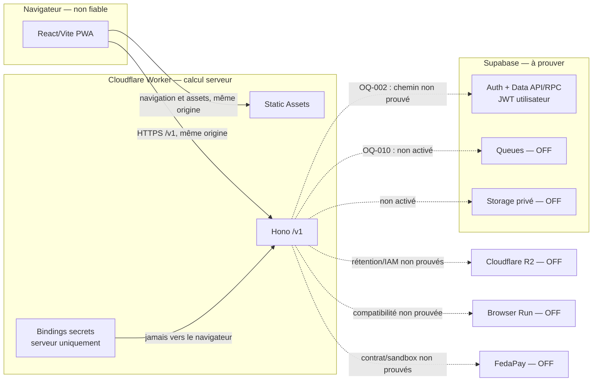

# S0-006 — Plan de POC topologie Supabase + Cloudflare

- Statut : **PARTIELLEMENT EXÉCUTÉ — POC WEB/WORKER PROUVÉ**
- Date : **2026-08-27**
- Porte : **`GATE-0` reste rouge**

Ce document décrit le POC et consigne ses preuves rejouables. Le socle React/Vite/Static Assets/Hono a été construit, testé localement puis déployé sur Cloudflare le 2026-08-27. Il ne prouve encore aucune intégration Supabase métier, FedaPay, R2, Browser Run ou Queue. Le statut factuel reste celui de [GATE-0](../gates/GATE-0.md), qui demeure rouge.

## Vue rapide

| Surface                | Cible du POC                                       | État honnête                               |
| ---------------------- | -------------------------------------------------- | ------------------------------------------ |
| Entrée web             | React/Vite servi par Workers Static Assets         | **VERT local et Cloudflare**               |
| API                    | Hono sous `/v1`, même origine que la PWA           | **VERT local et Cloudflare**               |
| Données                | Supabase sous JWT utilisateur, Data API/RPC et RLS | bloqué par `OQ-002`/`OQ-010`, non prouvé   |
| Secrets                | bindings Cloudflare côté Worker uniquement         | aucun secret activé ; exemple expurgé      |
| Intégrations sensibles | Queues, Storage, R2, Browser Run et FedaPay        | OFF jusqu'aux décisions et preuves dédiées |

## 1. Références normatives

- `S0-006` exige de valider la PWA React/Vite servie par Cloudflare Workers, l'API Hono, Supabase Auth/Postgres/Storage/Queues, R2, Browser Run, les secrets/bindings, l'observabilité et le POC Worker → Supabase/FedaPay (ROADMAP, §3.2 `S0-006`, l. 181–191).
- `NFR-005` interdit les mutations financières en file hors ligne navigateur ; `NFR-006` interdit le cache public sensible et exige des accès temporaires aux fichiers privés ; `NFR-007` exige mesures et seuils par parcours ; `NFR-008` exige autorisation serveur et audit (PRD, §10, l. 584–594).
- `NFR-015` verrouille React/Vite PWA + Cloudflare Workers + Supabase + FedaPay côté serveur ; `NFR-016` exige RLS, privilèges minimaux, tests allow/deny et aucune clé secrète ou `service_role` dans le navigateur (PRD, §10, l. 600–601).
- La topologie et les frontières applicatives sont définies par le STI §1.1–1.3 et §2 (`TD-001` à `TD-019`) : Static Assets, API `/v1`, Postgres autoritatif, Queues durables, R2 de reprise et Storage privé (STI, l. 20–110).
- Le chemin Data API/RPC et la propagation du JWT utilisateur relèvent du STI §7.1–7.2 et §8.4 (STI, l. 452–482 et 576–583). Leur mécanisme exact reste ouvert dans [`OQ-002`](../decisions/OPEN-QUESTIONS.md).
- L'atomicité outbox + `pgmq.send` relève du STI §14.1 (STI, l. 967–983) et reste ouverte dans [`OQ-010`](../decisions/OPEN-QUESTIONS.md).
- Les secrets, métriques, environnements et portes d'activation relèvent du STI §16.2, §17, §19.1, §19.4 et §20 (STI, l. 1076–1083, 1096–1134, 1233–1265 et 1280–1297).

## 2. Objectif borné du POC

Le premier incrément doit seulement démontrer, sur un environnement local sans données réelles :

1. qu'un même Cloudflare Worker sert les assets construits par React/Vite et route `/v1/*` vers Hono ;
2. que `GET /` rend l'entrée statique de la PWA et que `GET /v1/health` rend un JSON minimal sans secret ;
3. qu'une route `/v1/*` inconnue retourne une erreur API JSON et ne tombe jamais sur le fallback SPA ;
4. que le navigateur ne reçoit aucun secret, ne calcule aucun montant autoritatif et ne met aucune mutation financière en file hors ligne (`NFR-005`, `NFR-008`, `NFR-016`) ;
5. que le Worker est la seule frontière envisagée pour vérifier JWT, origine, schéma d'entrée, autorisation, corrélation et audit avant une commande sensible.

Le choix **same-origin** concerne l'application et son API : l'origine qui sert la PWA sert aussi `/v1`. Il ne préjuge pas du domaine de webhook de production, que le STI autorise à séparer si nécessaire (STI §19.4, l. 1263–1265).

Ne font pas partie de ce premier incrément : schéma métier, mutation SQL réelle, paiement, rendu PDF, stockage de fichier, message asynchrone, appel fournisseur ou secret de production.

## 3. Topologie prévue



Les flèches pointillées représentent des intégrations cibles **désactivées**, pas des connexions opérationnelles.

## 4. Routage same-origin à prouver

| Requête                      | Responsable prévu                     | Réponse attendue du POC                              | Garde                                                            |
| ---------------------------- | ------------------------------------- | ---------------------------------------------------- | ---------------------------------------------------------------- |
| `GET /` et assets versionnés | Cloudflare Workers Static Assets      | HTML/assets React/Vite                               | aucun secret injecté dans le bundle                              |
| route PWA non API            | Static Assets avec fallback SPA borné | entrée PWA                                           | le fallback n'intercepte jamais `/v1/*`                          |
| `GET /v1/health`             | Hono Worker                           | JSON minimal, statut et `correlationId` non sensible | aucune lecture Supabase ou fournisseur                           |
| `/v1/*` inconnue             | Hono Worker                           | `404` JSON stable                                    | jamais `index.html`, jamais stack trace                          |
| commande sensible future     | Hono Worker                           | hors périmètre de ce POC                             | JWT/origine/Zod/autorisation/audit obligatoires avant activation |

La PWA collecte une intention et affiche une projection ; elle ne confirme pas un paiement et ne devient jamais source de vérité financière (STI §1.1, l. 42–50). En perte réseau, toute future confirmation financière doit être désactivée avec reprise explicite, sans `Background Sync` (STI §15, l. 1058–1062 ; `NFR-005`).

### Décision d’implémentation — mise à jour du shell PWA

Les sources normatives exigent une PWA et un cache prudent, mais ne prescrivent ni stratégie de mise à jour du Service Worker, ni `skipWaiting`, ni rechargement automatique, ni libellé de prompt. Le comportement suivant est donc une décision d’implémentation compatible, et non une nouvelle règle produit :

- `registerType: "prompt"` est conservé ; `autoUpdate`, `clientsClaim` et l’activation automatique ne sont pas introduits ;
- une version en attente est annoncée dans le flux par un prompt non modal et accessible, sans déplacement de focus ;
- seul le clic « Mettre à jour et recharger » arme le rechargement de l’onglet courant ; une activation venue d’un autre onglet affiche « Recharger maintenant » sans navigation silencieuse ;
- « Plus tard » masque une version encore en attente et « Continuer sans recharger » annule l’intention de navigation si l’activation tarde ; une version déjà activée reste signalée jusqu’au rechargement explicite ;
- aucune saisie Auth/OTP n’est sérialisée pour survivre au rechargement, et la politique de cache reste inchangée : shell public pré-caché, `runtimeCaching: []` et `/v1` exclu du fallback de navigation.

La preuve E2E à trois onglets force un vrai cycle `waiting` → `controlling` sur le build de production. Elle vérifie, sur ce cycle, l’onglet qui accepte, celui qui diffère, celui dont le contrôle focalisé disparaît, ainsi que la conservation des saisies e-mail `X-01` et l’absence de navigation sans consentement. Elle ne prouve pas encore `X-02` ni une saisie OTP ; ce scénario devra être répété lorsque cet écran existera.

## 5. Frontières de confiance

| Frontière                     | Entrées non fiables                               | Contrôles exigés                                                                           | Données/secrets interdits                                                   |
| ----------------------------- | ------------------------------------------------- | ------------------------------------------------------------------------------------------ | --------------------------------------------------------------------------- |
| Navigateur → Worker           | URL, headers, JWT, JSON, identifiants de contexte | HTTPS, route allowlistée, `Origin`, JWT officiel, schéma fermé, idempotence selon commande | secret Supabase, `service_role`, secret FedaPay, montant/statut autoritatif |
| Worker → Supabase utilisateur | JWT utilisateur et contexte résolu                | décision `OQ-002`, `auth.uid()`, RLS, grants minimaux, RPC étroite, tests allow/deny       | UUID du corps comme autorité, requête générique privilégiée                 |
| Worker technique → Supabase   | webhook/queue/cron borné                          | fonction dédiée, portée serveur, permission minimale, audit                                | usage générique du `service_role`                                           |
| Worker → services externes    | enveloppe, fichier, message ou appel fournisseur  | porte d'activation propre, timeout, idempotence, minimisation, journalisation expurgée     | token, payload brut inutile, numéro Mobile Money complet, donnée carte      |
| Stockage/rendu → navigateur   | fichier privé ou URL temporaire                   | réautorisation, audience, URL courte ou proxy, `no-store`, anti-sniffing                   | bucket public, clé objet utilisée comme autorisation (`NFR-006`)            |

Le Worker doit recevoir les secrets exclusivement par bindings Cloudflare chiffrés et distincts par environnement. Les seules valeurs éventuellement publiques de la PWA sont la configuration publique strictement nécessaire, dont la clé Supabase **publiable** lorsqu'elle sera activée ; aucune valeur réelle n'est inscrite ici (STI §19.1, l. 1233–1237).

## 6. Matrice de responsabilité et d'activation

Dans cette matrice, **OFF** signifie absence volontaire de binding, secret et chemin d'appel dans le POC ; ce n'est pas un feature flag caché.

| Composant                | Responsabilité normative                             | Autorité                                                         | Secret/identité                                     | État du POC    | Condition avant activation                                                     |
| ------------------------ | ---------------------------------------------------- | ---------------------------------------------------------------- | --------------------------------------------------- | -------------- | ------------------------------------------------------------------------------ |
| React/Vite PWA           | UI, intention, lectures prudentes                    | aucune autorité financière                                       | configuration publique seulement                    | **VERT POC**   | build reproductible et PWA/same-origin prouvés                                 |
| Cloudflare Static Assets | servir le build PWA                                  | aucune donnée métier                                             | aucun secret dans les assets                        | **VERT POC**   | routage, CSP et cache vérifiés localement et sur Cloudflare                    |
| Hono Worker `/v1`        | API canonique, validation, auth, commandes sensibles | frontière serveur ; Postgres reste autoritatif                   | aucun secret requis par ce POC                      | **VERT POC**   | UUID serveur, erreurs corrélées, logs expurgés et smoke tests prouvés          |
| Supabase Auth            | identité et session officielles                      | `auth.users.id`                                                  | JWT utilisateur                                     | non connecté   | preuves `S0-003` et configuration d'environnement                              |
| Postgres/Data API/RPC    | vérité métier/financière, RLS                        | Postgres                                                         | JWT utilisateur pour appel initié par l'utilisateur | **NON PROUVÉ** | fermeture `OQ-002`, migrations/grants/RLS/pgTAP et POC Worker → Supabase       |
| Supabase Queues          | inbox/outbox et effets durables                      | identifiants canoniques seulement dans les messages              | appel technique borné                               | **OFF**        | fermeture `OQ-010`, visibilité/ack/retry/DLQ/sweeper et crash tests            |
| Supabase Storage         | reçus et preuves privés                              | métadonnées métier en base                                       | accès signé court après autorisation                | **OFF**        | buckets/politiques/quota/MIME/rétention/URL testés                             |
| Cloudflare R2            | journal indépendant de reprise pré-FedaPay           | ne peut jamais établir `PAID` seul                               | clé de chiffrement séparée, IAM minimal             | **OFF**        | rétention/IAM/purge décidés, création conditionnelle/ETag/restauration prouvés |
| Cloudflare Browser Run   | rendu PDF déterministe                               | aucune autorité métier                                           | binding Worker uniquement                           | **OFF**        | quotas/timeouts/isolation réseau/fermeture/charge testés                       |
| FedaPay                  | devis/charge/événements fournisseur                  | approbation seulement après webhook authentifié et rapprochement | secrets Worker uniquement                           | **OFF**        | contrat, sandbox, signature, idempotence, états, lookup et reprise prouvés     |
| Worker planifié          | consumers, sweeper, jobs                             | commandes techniques bornées                                     | bindings serveur                                    | **OFF**        | Queues et observabilité activées avec tests de replay                          |

R2 respecte en cible le STI §3.3 et §20 : création conditionnelle, chiffrement authentifié, ETag, verrou de rétention et restauration doivent être prouvés avant tout appel créant une charge (STI, l. 238–240 et 1293). Browser Run et Storage restent bloqués avant leurs tests spécifiques (STI §13.1–13.2, l. 942–965 et §20, l. 1289–1295).

## 7. Observabilité minimale du POC

Le POC doit journaliser uniquement : environnement non sensible, service, route canonique, statut, durée et `correlationId`. Il ne journalise jamais JWT, headers d'autorisation, paramètres secrets, corps fournisseur, OTP ou données personnelles (STI §16.2, l. 1076–1083).

Mesures minimales :

- disponibilité et latence de `/` et `/v1/health` ;
- taux de réponses `2xx`, `4xx` et `5xx` par route normalisée ;
- compteur de refus d'origine sans valeur d'origine brute ;
- absence de donnée sensible dans logs et erreurs.

Ces mesures ne satisfont pas encore `NFR-007` : seuils, propriétaires, alertes et runbooks restent à approuver et tester avant pilote (STI §17, l. 1096–1128).

## 8. Commandes de preuve expurgées

Ces commandes ont été exécutées le **2026-08-27** sur le squelette final. `<LOCAL_PORT>` et tous les jetons restent des placeholders dans la documentation ; aucune clé ou valeur secrète n'apparaît dans les preuves.

> [!WARNING]
> Les commandes ciblant `apps/web` et `apps/worker`, ainsi que les scripts racine, existent et ont été rejoués avec succès sur le squelette courant. Ils doivent être rejoués une dernière fois sur l'arbre final de la PR ; les résultats observés ci-dessous ne valent que pour le commit testé.

### Terminal A — installation, contrôles et serveur local

```powershell
pnpm install --frozen-lockfile
pnpm --filter ./apps/web build
pnpm --filter ./apps/worker typecheck
pnpm --filter ./apps/worker dev -- --local --port <LOCAL_PORT>
```

### Terminal B — séparation Static Assets / API

```powershell
$env:LOYA_POC_ORIGIN = 'http://127.0.0.1:<LOCAL_PORT>'

curl.exe --fail-with-body --silent --show-error "$env:LOYA_POC_ORIGIN/"
curl.exe --fail-with-body --silent --show-error `
  -H "Accept: application/json" `
  "$env:LOYA_POC_ORIGIN/v1/health"
curl.exe --silent --show-error --include `
  -H "Accept: application/json" `
  "$env:LOYA_POC_ORIGIN/v1/route-inexistante"
```

Preuves attendues : `/` est du HTML statique ; `/v1/health` est du JSON ; la route inconnue est un `404` JSON et ne contient ni HTML SPA, ni stack trace, ni configuration.

### Contrôles négatifs

```powershell
pnpm check:s0

if (rg -n -i "service[_-]?role|fedapay.*secret|private[_-]?key|bearer [a-z0-9]" apps/web/dist) {
  throw 'Secret potentiel détecté dans le bundle web'
}

pnpm why next fastify redis ioredis bullmq
git diff --check
```

Le scan doit être complété par le scanner de secrets CI. Une sortie de commande publiée doit être relue et expurgée ; les noms de bindings peuvent être inventoriés, jamais leurs valeurs.

### Résultats observés

| Preuve                          | Résultat                                                                                                                                        |
| ------------------------------- | ----------------------------------------------------------------------------------------------------------------------------------------------- |
| `pnpm check`                    | `32/32` garde-fous, `12/12` tests unitaires, `7/7` tests runtime Workers, format/lint/types et builds réussis                                   |
| `pnpm test:e2e`                 | `6/6` scénarios Chromium, dont un cycle réel de mise à jour PWA à trois onglets avec rechargement consenti                                      |
| `pnpm audit --audit-level high` | aucune vulnérabilité connue après correction du graphe transitif                                                                                |
| `wrangler dev`                  | `/` répond `200 text/html` avec CSP ; `/v1/health` répond `200 application/json` ; `/v1` et une route inconnue répondent `404 application/json` |
| Corrélation                     | le Worker remplace un `X-Request-Id` fourni par le client par un UUID serveur et le renvoie dans le header, le JSON et les logs canonisés       |
| `wrangler deploy`               | version `04604e8b-47c1-42ba-a5cf-13e927191c14` déployée, startup Worker mesuré à `11 ms`, binding non secret `ENVIRONMENT=s0-poc` uniquement    |
| Smoke test externe              | mêmes statuts, types de contenu, CSP et politique `no-store` observés sur `https://loya-s0-topology-poc.morelhouanho.workers.dev`               |

Les invocation logs et traces automatiques sont désactivés pour éviter la conservation de query strings ; seuls les événements applicatifs structurés, à route canonisée et sans entrée brute, sont persistés. Leur réactivation exige une preuve de redaction conforme au STI §16.2.

### Preuve Supabase différée

Après fermeture de `OQ-002` et `OQ-010`, un test d'intégration dédié devra obtenir un JWT éphémère par le harnais de test sans l'imprimer, appeler une projection/RPC de test via le Worker, puis prouver : même `auth.uid()`, refus sans JWT, refus autre Agence, RLS allow/deny et absence de `service_role` côté navigateur. Aucun de ces résultats n'est acquis aujourd'hui.

## 9. Critères de sortie du POC

| Preuve                                               | Statut actuel                     | Condition de réussite                                 |
| ---------------------------------------------------- | --------------------------------- | ----------------------------------------------------- |
| Diagramme et responsabilités                         | **DOCUMENTÉ, NON EXÉCUTABLE**     | revue architecture de ce document                     |
| Build React/Vite servi par Static Assets             | **VERT local et externe**         | build + réponses HTTP + CSP prouvés                   |
| Hono `/v1` same-origin et séparation du fallback SPA | **VERT local et externe**         | `/v1`, inconnue et health testés                      |
| Secret uniquement en binding Worker                  | **PARTIEL — aucun secret activé** | Gitleaks PR `#5` vert ; première activation à prouver |
| Worker → Supabase sous JWT/RLS                       | **BLOQUÉ / NON PROUVÉ**           | `OQ-002` fermée + POC allow/deny                      |
| Outbox → Supabase Queues atomique                    | **BLOQUÉ / NON PROUVÉ**           | `OQ-010` fermée + migration et crash tests            |
| R2, Storage, Browser Run                             | **OFF / NON PROUVÉ**              | chaque porte STI §20 satisfaite                       |
| Worker → FedaPay                                     | **OFF / NON PROUVÉ**              | `S0-002`, contrat et sandbox satisfaits               |
| Régions, limites CPU/temps, coûts, SLO               | **NON PROUVÉ**                    | valeurs approuvées, mesures et runbooks               |
| Absence de stack interdite                           | **VERT sur le squelette**         | contrôle automatique maintenu en CI                   |

## 10. Conclusion GATE-0

Ce document apporte le plan, le diagramme, la matrice de responsabilité et les preuves du sous-ensemble React/Vite/Static Assets/Hono/Cloudflare demandé par `S0-006`. Le manifeste Wrangler, les types de bindings, le build, les tests runtime, le routage same-origin, la CSP et un déploiement externe sont prouvés. Il n'apporte aucune preuve Worker → Supabase/FedaPay, Queue, Storage, R2, Browser Run, région, coût ou reprise et ne ferme ni `OQ-002`, ni `OQ-009`, ni `OQ-010`, ni une décision fournisseur/exploitation.

En conséquence, `S0-006` est **PARTIELLEMENT PROUVÉE** et `GATE-0` reste **ROUGE**. Sa clôture exige les preuves restantes listées dans la ROADMAP, l. 181–191, le STI §20 et [GATE-0](../gates/GATE-0.md), sans activer prématurément R2, Queues, Storage, Browser Run ou FedaPay.
